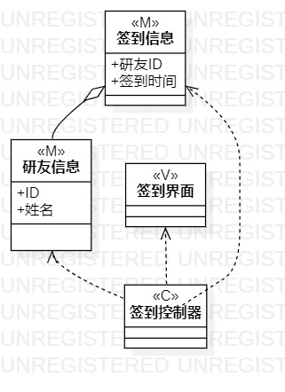

# 实验四

## 1.实验目标

- 掌握类建模方法
- 掌握类图的画法

## 2.实验内容

- 根据用例规约画出类图

## 3.实验步骤

###3.1 观看教学视频和实验要求
- 教学视频地址：https://www.bilibili.com/video/BV12E411w7vd
- 实验要求地址：https://github.com/hzuapps/uml-modeling-2020/issues/4
###3.2 学习内容
- 类的概念：类是对某种类型的对象定义变量和方法的原型，表示了对现实生活中一类具有共同特征的事物的抽象。
- UML中类的命名应明确、无歧义，有利于交流和理解。
- 类的属性和操作中的可见性用public、portected、private、package(+、#、-、~)区别
- 类之间的关系：关联（实线）、聚合（实线空心菱形箭头）、组合（实线实心菱形箭头）、继承（实线空心三角箭头）、依赖（虚线箭头）。
- MVC框架：M是指模型，V是指视图，C是指控制器。该框架将逻辑、数据和页面显示分离的方法组织代码，将业务逻辑聚集到一个部件里。
###3.3 确定用例中的具体类
- 签到类图：1.研友信息和签到信息都是模型（M），其中研友信息是签到信息的组成部分，故研友信息聚合于签到信息；2.签到控制器用于实现签到业务的逻辑；3.签到界面则为签到活动的视图
- 上传学习计划类图：1.研友信息和学习计划都是模型（M），其中研友信息是学习计划的组成部分，故研友信息聚合于学习计划；2.上传学习计划控制器用于实现上传学习计划业务的逻辑；3.上传学习计划界面则为上传学习计划活动的视图
- 分享学习经验类图：1.研友信息和学习经验都是模型（M），其中研友信息是学习经验的组成部分，故研友信息聚合于学习经验；2.分享学习经验控制器用于实现分享学习经验业务的逻辑；3.分享学习经验界面则为分享学习经验活动的视图
###3.4 画类图
- 根据确定的具体类，画出类
- 给不同类型的类标注上相应的类型
- 根据类之间的不同联系，连上关系

## 4.实验结果

图1：签到的类图

图2：上传学习计划的类图

图3：分享学习经验的类图

## 5.实验心得
- 通过完成这个实验，对类和MVC设计模式的概念有了更加深入的了解，在切分不同的类和类的类型时，对自己提出的系统进行了更深入的思考，特别是在类之间的关系连接的时候，对箭头的指向一开始还有一些疑惑，后面经过询问同学，才逐渐明了，但是本次实验应该还存在一些问题，要继续检查和修改。