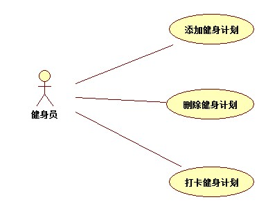

# 实验二

## 一、实验目标
1.熟悉github的使用
2.熟悉starUML的使用
3.熟悉Markdown撰写实验报告

## 二、实验内容
1.选题
2.使用StarUML画图
3.使用markdown写实验报告
4.将三个用例规约表编写在实验报告

## 三、实验步骤
- 在github中编写了健身keep选题
- github修改文件
- 在StarUML中画出了健身keep系统的三个用例图
- 将用例图和三个用例规约表总结于实验报告

## 四、实验结果

图1：健身keep系统的用例图

## 表1：添加健身计划用例规约  

用例编号  | UC01 | 备注  
-|:-|-  
用例名称  | 添加健身计划  |   
前置条件  |   用户登陆进系统   | *可选*   
后置条件  | 用户添加健身计划成功     | *可选*   
基本流程  | 1. 用户选择不同计划链接；  |*用例执行成功的步骤*    
~| 2. 系统显示健身计划页面；  |   
~| 3. 用户点击添加按钮；  |   
~| 4. 系统**查询到**健身计划，检查该计划**是否存在**，记录用户添加状态；  |   
~| 5. 系统显示首页。  |  
扩展流程  | 4.1 系统检查发现健身计划不存在，**提示“该计划不存在”**；  

## 表2：删除健身计划用例规约  

用例编号  | UC02 | 备注  
-|:-|-  
用例名称  | 删除健身计划  |   
前置条件  |   用户添加健身计划成功   | *可选*   
后置条件  | 用户删除健身计划成功     | *可选*   
基本流程  | 1. 用户选择已添加健身计划链接；  |*用例执行成功的步骤*    
~| 2. 系统显示已添加健身计划页面；  |   
~| 3. 用户点击删除按钮；  |   
~| 4. 系统**查询到**已添加健身计划，记录用户删除状态；  |   
~| 5. 系统显示首页。  |  
扩展流程  | 4.1 系统检查发现健身计划已经不存在，**提示“该计划不存在”**；  

## 表3：打卡健身计划用例规约  

用例编号  | UC03 | 备注  
-|:-|-  
用例名称  | 打卡健身计划  |   
前置条件  |   用户添加健身计划成功   | *可选*   
后置条件  | 用户打卡健身计划成功     | *可选*   
基本流程  | 1. 用户点击健身计划链接；  |*用例执行成功的步骤*    
~| 2. 系统显示健身计划页面；  |   
~| 3. 用户点击打卡按钮；  |   
~| 4. 系统**查询到**已添加健身计划，检查用户当天打卡信息，记录用户打卡状态；  |   
~| 5. 系统显示累计打卡天数页面。  |  
扩展流程  | 4.1 系统检查发现用户已打卡，**提示“不可重复打卡”**；    |*用例执行失败*    
~|  4.2 系统检查发现健身计划已经不存在，**提示“打卡失败”**； |

