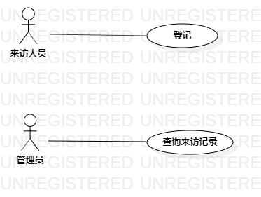

# 实验二：用例建模

## 一、 实验目标
- 理解用例建模的概念
- 学会用例建模

## 二、 实验内容
- 根据自己的建模选题绘制用例图

## 三、实验步骤
- 在StartUML中新建用例图
- 创建两个参与者：来访人员和管理员
- 创建两个实例：登记和来访记录查询

## 四、实验结果

图1. 来访登记系统的用例图

## 表1：登记用例规约  

| 用例编号 | UC01                                                         | 备注                 |
| -------- | :----------------------------------------------------------- | -------------------- |
| 用例名称 | 登记                                                         |                      |
| 前置条件 |                                                              | *可选*               |
| 后置条件 |                                                              | *可选*               |
| 基本流程 | 1.来访人员点击登记按钮；                                     | *用例执行成功的步骤* |
| ~        | 2.系统显示登记页面；                                         |                      |
| ~        | 3.来访人员输入被访人的姓名和房间号，再输入自己的姓名和联系方式，点击确认按钮； |                      |
| ~        | 4.系统查询到住户信息，检查被访人的姓名和房间号相匹配，记录来访人员的信息和来访时间； |                      |
| 扩展流程 | 4.1系统检查发现被访人不存在，**提示“被访人不存在”**；        | *用例执行失败*       |
| ~        | 4.2系统检查发现被访人的姓名和房间号不匹配，**提示“房间号错误”**。 |                      |

## 表2：查询来访记录用例规约  

| 用例编号 | UC02                                                         | 备注                 |
| -------- | :----------------------------------------------------------- | -------------------- |
| 用例名称 | 查询来访记录                                                 |                      |
| 前置条件 | 管理员已登录                                                 | *可选*               |
| 后置条件 |                                                              | *可选*               |
| 基本流程 | 1.管理员点击来访记录按钮；                                   | *用例执行成功的步骤* |
| ~        | 2.系统显示来访记录页面；                                     |                      |
| ~        | 3.管理员输入来访人员的姓名和来访时间，点击查询按钮；         |                      |
| ~        | 4.系统检查来访人员的姓名不为空，查询来访人员信息；         |                      |
| ~        | 5.系统显示来访人员来访记录。         |                      |
| 扩展流程 | 4.1系统检查来访人员的姓名为空，**提示“来访人员的姓名不能为空”**；    | *用例执行失败*       |
