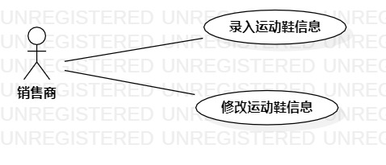

# 实验二

## 实验目标

- 掌握StarUML用例建模
- 确定选题
- 熟悉Markdown语法，用Markdown撰写实验报告

## 实验内容

- 仔细认真观看老师的视频，了解实验内容和实验目的
- 在GitHub上提交自己的选题
- 创建自己的第一个用例建模

## 实验步骤

- 1.构思好自己的选题内容，并将题目和功能提交到GitHub的issue中；
- 2.打开StarUML，画出自己的用例建模图；
- 3.编写实验报告，撰写用例规约。

## 绘制用例规约 
### 表1：添加运动鞋信息用例规约
用例编号  | UC01 | 备注  
-|:-|-  
用例名称  |  添加运动鞋信息 |   
前置条件  |  销售商已登录运动谢销售系统   | *可选*   
后置条件  |  销售商完成添加  | *可选*   
基本流程  | 1. 销售商点击添加按钮；  | *用例执行成功的步骤*
~| 2. 系统显示添加运动鞋页面；  | 
~| 3. 销售商输入运动鞋款式、运动鞋鞋码，运动鞋价格，点击确认按钮； |
~| 4. 系统检查输入内容是否为空，并且检查添加的运动鞋是否已存在，系统保存添加信息，并显示添加成功页面。 |    
扩展流程  | 4.1 系统检查添加的内容为空，显示“添加内容为空”;  |*用例执行失败的步骤*
~| 4.2 系统检查添加的运动鞋在系统中已经存在，显示“所添加款式已存在”。  |

### 表2：修改运动鞋信息用例规约
用例编号  | UC01 | 备注  
-|:-|-  
用例名称  |  修改运动鞋信息 |   
前置条件  |  销售商已登录运动谢销售系统   | *可选*   
后置条件  |  销售商完成修改  | *可选*   
基本流程  | 1. 销售商点击修改按钮；  | *用例执行成功的步骤*
~| 2. 系统显示修改运动鞋页面；  | 
~| 3. 销售商可修改运动鞋款式、运动鞋鞋码，运动鞋价格，点击确认按钮； |
~| 4. 系统检查修改内容是否为空，系统保存修改信息，并显示修改成功页面。 |    
扩展流程  | 4.1 系统检查添加的修改为空，显示“未修改”;  |*用例执行失败的步骤*

## 实验结果

-第二次实验用例建模实验图

## 五、实验总结

- 1. 实验开始因为自己视频看少了一个，导致用例规约没有写，从而在老师的批改之后发现自己少写了用例规约，提醒我下次要好好检查视频是否观看完整细心专注。
- 2.实验过程发现需要养成良好的表达习惯，少用一些修辞语句，简单直接，方便别人理解。
- 3.实验拥有许多不足的地方，需要自己以后好好改进。