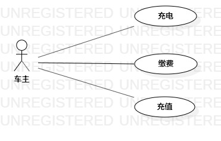

# 实验二：用例建模  

## 一、实验目标

1. 掌握StarUML用例建模；  
2. 掌握在Markdown编写实验报告和用例规约。

## 二、实验内容  

1. 在issues中提交选题；  
2. 用StarUML绘制用例图；  
3. 在Markdown中编写用例规约。  

## 三、 实验步骤

1. 创建选题：新能源汽车充电管理系统
2. 车主功能：
- 充电
- 缴费
- 充值
3. 打开StarUML并创建UseCaseDiagram
- 添加Actor：车主
- 添加Use Case：充电、缴费、充值
- 建立Actor与Use Case的联系
4. 编写实验报告和用例规范

## 四、实验结果

图1. 新能源汽车充电管理系统的用例图  

## 表1：充电用例规约
用例编号  | UC01 | 备注  
-|:-|-  
用例名称  | 充电 |   
前置条件  | 充电枪插入电动车充电连接口     | 
后置条件  |      | *可选*   
基本流程  | 1. 车主点击充电按钮  |*用例执行成功的步骤*    
~| 2. 系统弹出充电设置页面  |   
~| 3. 车主设置好充电时间，点击确认按钮  |   
~| 4. 系统检查充电时间格式正确，提示“充电成功”并开始计时 |   
扩展流程  | 4.1 系统检查充电时间格式错误，提示“您输入的时间格式有误，请检查后重新输入”  |*用例执行失败*   

## 表2：缴费用例规约  

用例编号  | UC02 | 备注  
-|:-|-  
用例名称  | 缴费  |   
前置条件  | 车辆正在充电或充电已经完成    |   
后置条件  | 车主将充电枪放回原位并将车开走    | 
基本流程  | 1. 车主点击结束充电按钮  |*用例执行成功的步骤*    
~| 2. 系统根据充电时间计算出充电费用，显示缴费界面  |   
~| 3. 车主点击缴费按钮  |   
~| 4. 系统检查车主账户余额充足，扣除本次充电的费用，提示“支付完成，祝您一路顺风”  |   
扩展流程  | 4.1 系统检查车主账户余额不足，提示“支付失败，请重新支付” |*用例执行失败* 

## 表3：充值用例规约  

用例编号  | UC03 | 备注  
-|:-|-  
用例名称  | 充值  |   
前置条件  | 车主账户余额不足    |   
后置条件  |     | 
基本流程  | 1. 车主点击充值按钮  |*用例执行成功的步骤*    
~| 2. 系统显示充值界面  |   
~| 3. 车主输入充值金额，点击确认充值按钮  |   
~| 4. 系统检查充值金额不为空，增加账户余额，提示“充值成功”  |   
扩展流程  | 4.1 系统检查充值金额为空，提示“充值失败，请输入充值金额再充值” |*用例执行失败*