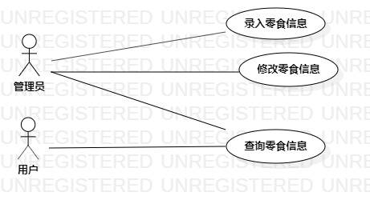

# 实验二

## 一.实验目标

1.创建并完善建模选题  
2.学会用StarUML画出系统用例图  
3.学会写出用例规约

## 二.实验内容

1.建立个人选题项目  
2.运用StarUML对自己选定的系统进行用例建模  
3.写出用例规约

## 三.实验步骤

1.确定所要建模的系统（零食库存管理系统）

2.确定系统（零食库存管理系统）功能  
- 录入零食信息  
- 修改零食信息  
- 查询零食信息

3.根据系统功能，确认角色和事件及彼此之间的联系，用StarUML画出用例图并检查  
- 两个角色：管理者和用户  
- 三个事件：录入、修改和查询零食信息  
- 联系：管理员可以录入零食信息、修改零食信息和查询零食信息，用户只可以查询零食信息

4.根据三个用例写出对应的用例规约

## 四.实验结果

  
图1：零食库存管理系统的用例图

## 用例规约的编写

### 表1：录入零食信息用例规约  

用例编号  | UC01 | 备注  
-|:-|-  
用例名称  | 录入零食信息 |   
前置条件  | 管理员登录系统 | *可选*   
后置条件  | 系统在零食信息中添加新的零食信息 | *可选*   
基本流程  | 1.管理员点击录入链接 |*用例执行成功的步骤*    
~| 2.系统显示录入页面 |   
~| 3.管理员输入零食名字和数量，点击录入按钮 |  
~| 4.系统检查要录入的零食数量，发现数量无误为自然数 |  
~| 5.系统查询零食信息，在原有的零食信息中没有查询到要录入的信息，将该信息添加到零食信息中 |   
~| 6.系统提示“录入成功” |  
扩展流程  | 4.1 系统在检查要录入零食数量时，发现数量为非自然数，系统提示“输入数量错误” |   
~| 5.1 系统在原有的零食信息中查询到要录入的信息，系统提示“该零食信息已存在” |  

### 表2：修改零食信息用例规约  

用例编号  | UC02 | 备注  
-|:-|-  
用例名称  | 修改零食信息 |   
前置条件  | 管理员登录系统 |   
后置条件  | 系统修改零食信息中对应的信息 | 
基本流程  | 1.管理员点击修改链接 |   
~| 2.系统显示搜索栏页面 |  
~| 3.管理员输入要修改信息的零食名称 |  
~| 4.系统在零食信息中查询到该零食信息，显示出该零食信息修改页面 |  
~| 5.管理员修改相应的零食信息，点击修改按钮 |  
~| 6.系统检查修改后的零食数量，发现数量无误为自然数 |    
~| 7.系统查询零食信息，发现修改后的零食信息与修改前零食信息不一致，系统保存修改的零食信息 | 
~| 8.系统提示“修改成功” |  
扩展流程  | 4.1 系统在零食信息中查询不到该零食信息，系统提示“无该零食信息” |
~| 6.1 系统在检查要录入零食数量时，发现数量为非自然数，系统提示“输入数量错误” |   
~| 7.1 系统查询零食信息，发现修改后的零食信息与修改前零食信息一致，系统提示“与修改前零食信息一致” |  

### 表3：查询零食信息用例规约  

用例编号  | UC03 | 备注  
-|:-|-  
用例名称  | 查询零食信息 |    
前置条件  | 用户或管理员登录成功 |   
后置条件  | 进入零食信息显示页面 |  
基本流程  | 1. 用户或管理员点击查询链接 |  
~| 2. 系统显示搜索栏页面 |
~| 3. 用户或管理员在搜索栏中输入需要查询的零食名称，点击搜索按钮 |
~| 4. 系统在零食信息中查询到该零食信息，显示出该零食信息显示页面 |
扩展流程  | 4.1 系统在零食信息中查询不到该零食信息，提示"查询不到该零食信息" |
