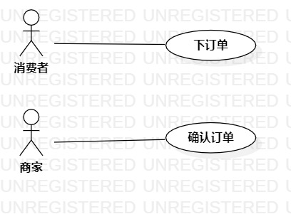

# 实验二：用例建模 

## 一、实验目标

1. 细化选题
2. 学习使用StarUML用例建模
3. 使用Markdown编写报告

## 二、实验内容

1. 创建用例图
2. 编写实验报告文档
3. 编写用例规约

## 三、实验步骤

1. 选题为"网购订单系统"
2. 根据issue在StarUML上创建用例图
3. 确定参与者为"消费者"
4. 确定用例为"添加商品" "确认订单"
5. 建立参与者与用例的关系
6. 画出用例图
7. 编写用例规约

## 四、实验结果

1. 画图

图1:网购订单系统的用例图

## 表1：添加商品用例规约 

用例编号  | UC01 | 备注  
-|:-|-  
用例名称  | 添加商品  |   
前置条件  | 进入网上商家店铺  | *可选*   
后置条件  |      | *可选*   
基本流程  | 1. 消费者点击商品  |*用例执行成功的步骤*    
~| 2. 系统显示商品简介页面  |   
~| 3. 消费者选择数量，点击添加至购物车  |   
~| 4. 系统查询商品库存信息，检查数量条件满足； |   
~| 5. 系统显示"添加成功"  |  
扩展流程  | 4.1 系统检查数量不足，提示消费者"该商品库存数量不足" |*用例执行失败*    

## 表2：确认订单用例规约  

用例编号  | UC02 | 备注  
-|:-|-  
用例名称  | 确认订单  |   
前置条件  | 消费者点击了购物车界面  | *可选*   
后置条件  |   | *可选*   
基本流程  | 1. 消费者点击确认订单链接；  |*用例执行成功的步骤*    
~| 2. 系统跳转到支付界面  |   
~| 3. 消费者选择支付方式，并完成支付  |   
~| 4. 系统跳转到完成支付界面  |   
扩展流程  | 3.1 消费者取消支付，系统显示"支付失败"  |*用例执行失败*    
~| 3.2 消费者余额不足以支付订单金额，系统显示"支付失败"  |  
