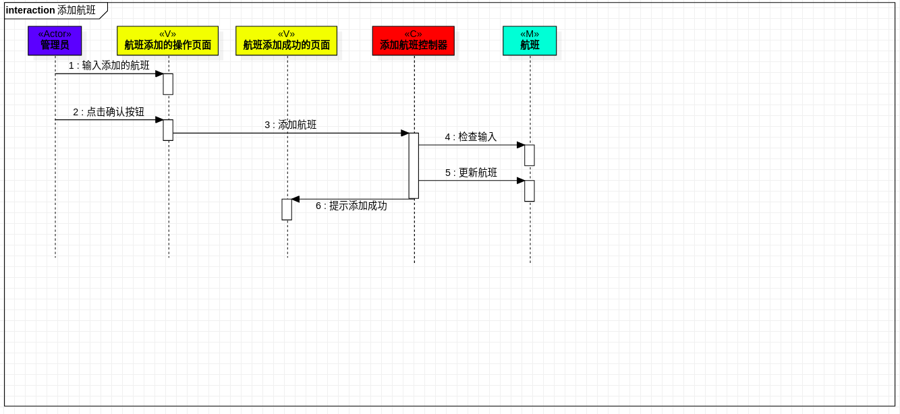
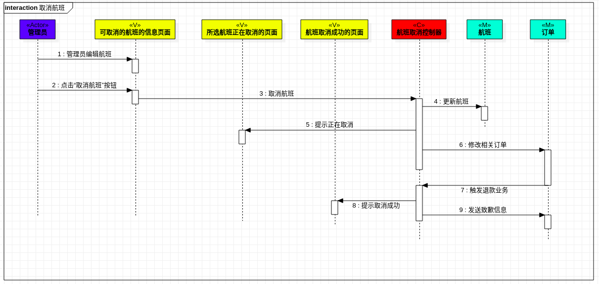

# 实验6名称：交互建模

## 一、实验目标

#### 1. 理解系统交互；
#### 2. 掌握UML顺序图的画法；
#### 3. 掌握对象交互的定义与建模方法。

## 二、实验内容

#### 1. 根据用例模型和类模型，确定功能所涉及的系统对象；
#### 2. 在顺序图上画出参与者（对象）；
#### 3. 在顺序图上画出消息（交互）。

## 三、实验步骤

#### 1. 观看录制视频、学习课堂文档：
1.1 学习来源：
- [b站资料](https://space.bilibili.com/44472532/)的实验6部分
- [实验6内容及讲义](https://github.com/hzuapps/uml-modeling-2020/issues/6)
1.2 学习笔记：
1.2.1 基本概念
- 对象的概念及其画法： 对象是类的实体，title要有横线，类的首字母大写，对象的首字母小写。 
- 顺序图的构成与时间顺序：由参与者和消息的交互构成。时间先后对应从上到下，时间的顺序会自动标号。
- 参与者的存活条/激活条的画法：点击Lifeline。
- 消息画法：点击Message，并编辑消息名称。
1.2.2 实验要求及注意事项
- 顺序图和用例图的数量要相等。
- 总集里面有分集的时间表示，可以跳时间分开看。
1.2.3 视频演示收获
- 先找到第一个参与者（一般是系统外的用户），然后根据类图（lab3）找到N个参与者，最后结合活动图传递消息。注意期间可能需要改进类图和活动图。
1.2.4 问题汇总
- 问题1： 提交文件冲突。原因是，多次修改导致gihub无法识别修改。解决方式是先从备份处拷贝相关文件，保证没有冲突先，之后再进行修改。
- 问题2： 建议不要M发送信息给M。原因是，控制器是交互的核心，这样逻辑比较清晰。解决方式是以控制器为媒介，进行M之间的消息传递。
- 问题3： 允许Actor与M类同名。原因是，Actor是系统外的，M类是系统内部的，不会产生混淆。解决方式是，以准确表达意思为准，不必刻意同名，也不需避开同名。
#### 2. 确定核心要素
2.1 "1 + N"参与者的确定： 主要根据类图确定
- 添加航班： 管理员 + （航班、添加航班控制器、航班添加成功的页面和航班添加的操作页面）
- 取消航班： 管理员 + （航班、订单、航班取消控制器、所选航班正在取消的页面、可取消的航班的信息页面和航班取消成功的页面）
2.2 消息确定： 主要根据活动图确定

## 四、实验结果

#### 1. 顺序图1：添加航班

#### 2. 顺序图2：取消航班

## 五、实验总结
- 实验总是需要迭代修改的，不能期望一次性完成实验，而且要反复检查，才能尽可能避免低级错误。老师若是提到不足的地方，要主动修改，想想有没有类似的错误。
- 先找到第一个参与者（一般是系统外的用户），然后根据类图找到N个参与者，（就有1+N个参与者了），最后结合活动图传递消息。注意期间（很）可能需要改进类图和活动图。
