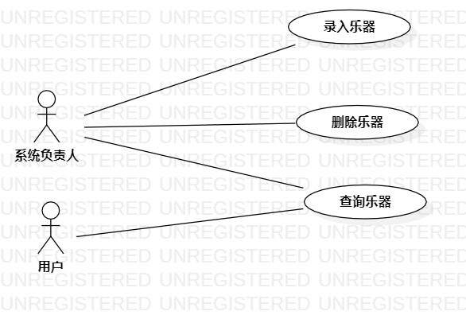

# 实验二 用例建模

## 一、实验目标

1. 学会使用Markdown编写实验报告
2. 掌握用例的概念和用例建模

## 二、实验内容

1. 提交个人选题到Issues
2. 用Markdown完成实验报告
3. 用StartUML完成用例建模

## 三、实验步骤

1. 在issues上提交“乐器信息查询系统”选题与相关功能：

- 录入乐器信息
- 查询乐器信息
- 删除乐器信

1. 根据选题和所选功能在StarUML上画出用例图：

- 创建“系统负责人”和“用户”两个参与者
- 创建三个用例
- 建立关系Association

1. 编写用例规约
2. 将用例图和实验报告提交

## 四、实验结果

图1：“乐器信息查询系统”用例图

## 表1：录入乐器信息用例规约

| 用例编号 | UC01                      | 备注          |
| ---- | ------------------------- | ----------- |
| 用例名称 | 录入乐器信息                    |             |
| 前置条件 | 系统负责人进入录入信息界面             | *可选*        |
| 后置条件 |                           | *可选*        |
| 基本流程 | 1.系统负责人点击录入按钮；            | *用例执行成功的步骤* |
| ~    | 2.系统显示录入页面；               |             |
| ~    | 3.系统负责人录入乐器各方面的信息，然后点击确定； |             |
| ~    | 4.系统显示录入成功页面。             |             |
| 扩展流程 | 3.1系统提示乐器信息已存在，请勿重复录入。    | *用例执行失败*    |

## 表2：查询乐器信息用例规约

| 用例编号 | UC02               | 备注          |
| ---- | ------------------ | ----------- |
| 用例名称 | 查询乐器信息             |             |
| 前置条件 | 用户进入乐器查询界面         | *可选*        |
| 后置条件 |                    | *可选*        |
| 基本流程 | 1. 用户点击搜索框；        | *用例执行成功的步骤* |
| ~    | 2. 输入乐器名，点击搜索；     |             |
| ~    | 3.系统检测数据库，匹配乐器名；   |             |
| ~    | 4. 系统匹配成功，返回乐器信息；  |             |
| 扩展流程 | 3.1 系统检测数据库，匹配不成功； | *用例执行失败的步骤* |
|      | 3.2 返回用户查询界面；      |             |
|      | 3.3 系统提示无该乐器信息；    |             |

## 表3：删除乐器信息用例规约

| 用例编号 | UC03                   | 备注          |
| ---- | ---------------------- | ----------- |
| 用例名称 | 删除乐器信息                 |             |
| 前置条件 | 系统负责人进入删除信息界面          | *可选*        |
| 后置条件 |                        | *可选*        |
| 基本流程 | 1.负责人点击查询所有按钮；         | *用例执行成功的步骤* |
| ~    | 2.系统显示所有乐器信息的页面；       |             |
| ~    | 3.负责人选中想要删除的乐器信息，点击删除； |             |
| ~    | 4.系统跳出提出框，提示是否删除；      |             |
| ~    | 5.负责人点击确定，删除成功；        |             |
| 扩展流程 | 5.1 系统显示删除失败，请重新删除；    | *用例执行失败*    |