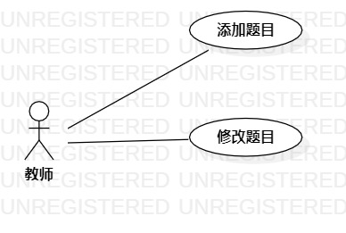

# 实验二 用例建模

## 1 实验目的
1.1 加强github的使用   
1.2 掌握画用例图  
1.2 掌握如何编写用例规约    
## 2 实验内容
2.1 使用Markdown编写实验报告  
2.2 创建用例图
2.3 编写用例规约
## 3 实验步骤
3.1  建模选题 
3.2  功能需求   
（1） 添加题目  
（2） 删除题目
（3）查看题目
3.3  创建用例图  
（1）添加教师，学生
（2）添加三个用例
（3）建立联系  
3.4 编写用例规约  
（1）编写查看用例规约
（2）编写添加用例规约
（3）编写删除用例规约
## 实验结果
  
 图1：用户发帖以及回帖图
## 表1：查看用例规约  

用例编号  | UC01 | 备注  
-|:-|-  
用例名称  | 查看  |   
前置条件  |      | *可选*   
后置条件  |      | *可选*   
基本流程  | 2.1点击题目链接，检测用户是否登录  |*用例执行成功的步骤*    
~| 2.2系统显示题目内容页面  |  
扩展流程  | 2.1 系统检测用户未登录 则提示“未登录” |*用例执行失败*    

## 表2：删除用例规约  

用例编号  | UC02 | 备注  
-|:-|-  
用例名称  |删除  |   
前置条件  |      | *可选*   
后置条件  |      | *可选*   
基本流程  |2.1 教师点击题目删除按钮 |*用例执行成功的步骤*    
~| 2.2 系统检测身份是否为教师，如果是则提示“删除成功” |    
扩展流程  | 2.2  系统检测身份不是老师 则提示“无权操作” |*用例执行失败*    
 ## 表2：添加用例规约  

用例编号  | UC03 | 备注  
-|:-|-  
用例名称  |添加 |   
前置条件  |      | *可选*   
后置条件  |      | *可选*   
基本流程  |2.1 教师点击添加题目按钮 |*用例执行成功的步骤*    
~| 2.2 系统检测是否登录且身份为教师，如果是，则进入添加题目页面 |
~| 2.3 输入题目的内容，答案，以及相关图片 |
~| 2.4 
扩展流程  | 2.2  系统检测身份不是老师 则提示“无权操作” |*用例执行失败*    
