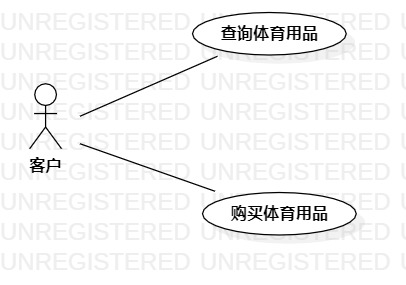

# 实验二 用例建模

## 一、实验目标

1.理解用例概念  
2.使用StarUML对用例建模

## 二、实验内容

1.对自己创建的选题进行用例建模

## 三、实验步骤

1.创建两个actor为：体育用品店老板、客户  
2.创建四个use case为：添加体育用品、发布体育用品规格及品牌、查询体育用品、购买体育用品  
3.用直线连接体育用品店老板及客户和四个use case  
4.写出添加体育用品、发布体育用品规格及品牌、查询体育用品和购买体育用品的用例规约

## 四、实验结果

图1.体育用品销售管理系统用例图

 ## 表1：查询体育用品
 
用例编号 | 01 | 备注
---|---|---
用例名称 | 查询体育用品 |
前置条件 | 客户进入查询体育用品界面 |可选
后置条件 |  |可选
基本流程 | 1.客户输入想要查询的体育用品名称，点击查询按钮 |用例执行成功的步骤
 | |2.系统检查输入名称不为空，查询体育用品信息
 | |3.系统查询体育用品存在，显示客户查询的体育用品信息
 扩展流程| 2.1系统检查输入体育用品名称为空，提示”输入名称不能为空“|用例执行失败
 
## 表2：购买体育用品

用例编号 | 02 | 备注
---|---|---
用例名称 | 购买体育用品 |
前置条件 | 客户进入购买体育用品界面 |可选
后置条件 |  |可选
基本流程 | 1.客户进入购物车页面 |用例执行成功的步骤
 | |2.系统查询客户的购物订单
 | |3.系统显示客户的购物订单
 | |4.客户确认完毕，点击支付按钮
 | |5.系统检查客户余额，客户余额充足
 | |6.系统删除已支付订单，扣除余额
 | |7.系统显示“支付成功”
 扩展流程| 5.1系统检查客户余额不足，提示“支付失败”|用例执行失败

