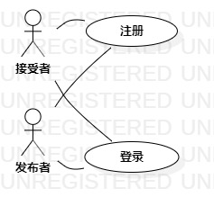
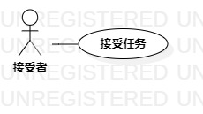

# 实验二：用例建模

## 一、实验目标

1.使用Markdown编写报告  
2.细化选题  
3.学习使用StarUML用例建模

## 二、实验内容

1.创建用例图  
2.编写实验报告文档  
3.编写用例规约

## 三、实验步骤

1.选题为任务系统  
2.根据issues在StarUML上创建用例图（Lab2_UseCaseDiagram）  
3.确定参与者（Actor）：  
    - 发布者  
    - 接受者  
4.确定用例（UseCase）：  
    - 发布任务  
    - 接受任务  
5.建立Actor和UseCase之间的联系  
6.绘画用例图（Lab2_UseCaseDiagram、Lab2_UseCaseDiagram1、Lab2_UseCaseDiagram2）  
7.编写用例规约

## 四、实验结果

1.画图

  
图1.在StarUML上画出第一张用例图

2.余下用例图

  
图2.发布者发布任务

  
图3.接受者接受任务

## 表1：发布任务用例规约  

用例编号  | UC01 | 备注  
-|:-|-  
用例名称  | 发布任务  |   
前置条件  | 发布者登录进入任务系统   | *可选*   
后置条件  | 发布者进入任务样品发布页面     | *可选*   
基本流程  | 1. 发布者点击发布任务按钮；  |*用例执行成功的步骤*    
~| 2. 系统显示任务样品发布页面；  |   
~| 3. 发布者填写任务标题、任务内容、任务悬赏；  |   
~| 4. 发布者点击发布按钮；  |   
~| 5. 系统查询该用户已发布任务标题无存在相同；  |   
~| 6. 系统保存任务信息；  |   
~| 7. 系统显示任务展示页面。  |  
扩展流程  | 4.1 系统发现该用户已发布相同的任务标题，提示发布者“该任务你已经发布了”。 |*用例执行失败*   

## 表2：接受任务用例规约  

用例编号  | UC02 | 备注  
-|:-|-  
用例名称  | 接受任务  |   
前置条件  | 接受者进入任务展示页面   | *可选*   
后置条件  | 系统弹出确认窗口   | *可选*   
基本流程  | 1. 接受者点击需要接受的任务链接；  |*用例执行成功的步骤*    
~| 2. 系统显示任务详细信息页面；  |   
~| 3. 接受者点击接受任务按钮；  |   
~| 4. 系统弹出确认窗口；  |   
~| 5. 接受者点击确认按钮；  |   
~| 6. 系统查询该任务所需人数大于已接受任务人数； |   
~| 7. 系统修改该任务的详细信息； |   
~| 8. 系统显示任务接受完成页面。  |  
扩展流程  | 5.1 接受者点击取消按钮，系统返回该任务详细信息页面。  |*用例执行失败*  
~| 6.1 系统发现所需人数小于或等于已接受任务人数，提示接收者“该任务所需人数已满”；  |   
