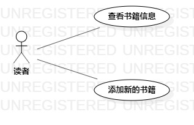

# 实验二：用例建模

## 1.实验目标

- 理解UML概念
- 使用StarUML画用例图

## 2.实验内容

- 确认选题
- 创建用例图
- 编写规约

## 3.实验步骤

### 确认选题--书单管理系统

- 查看书籍日志（书名、心得及阅读截至日期）
- 添加新的书籍日志（[书名、]心得及阅读截至日期）

### 创建用例图

- 创建用例图
- 添加参与者（读者）和两个用例（查看书籍日志、添加新的书籍日志）
- 建立参与者和用户间的联系

### 编写规约

- 见下方 表1、表2

## 4.实验结果

- 表1：查看书籍日志

用例编号  | UC01 | 备注  
-|:-|-  
用例名称  | 查看书籍日志  |   
前置条件  |     | *可选*   
后置条件  |      | *可选*   
基本流程  | 1.读者点击查看书籍日志按钮；  |*用例执行成功的步骤*    
~| 2.系统跳转查看书籍日志页面；  |   
~| 3.用户输入书名，随后点击确认按钮；  |   
~| 4.系统检索对应书籍日志，检查该书名存在书籍日志；  |   
~| 5.系统显示书籍日志页面。  |  
扩展流程  | 4.1系统检索对应书籍日志，检查该书名不存在书籍日志，提示读者“书籍不存在，请重新输入”。 |*用例执行失败* 

- 表2：添加新的书籍

用例编号  | UC02 | 备注  
-|:-|-  
用例名称  | 添加新的书籍  |   
前置条件  |     | *可选*   
后置条件  |      | *可选*   
基本流程  | 1.读者点击新增书籍日志按钮；  |*用例执行成功的步骤*    
~| 2.系统显示新增书籍日志界面；  |   
~| 3.读者输入书籍日志，点击确认按钮；  |   
~| 4.系统查询书名，检查书名不存在，创建新增书籍日志；  |   
~| 5.系统查看书籍日志界面。  |  
扩展流程  | 4.1系统查询书名，检查书名已存在，提示读者“书名存在，已插入新增信息”。    |*用例执行失败* 

  
图1 用例图
