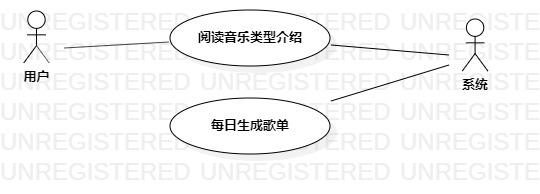

# 实验二: 用例建模

## 一、实验目标

1. 掌握用例概念。
2. 学会使用StarUML画用例图。

## 二、实验内容

1. 细化功能需求。
2. 画出用例图（Use Case Diagram）。
3. 编写用例规约（表格）。

## 三、实验步骤

1. 确认选题：Oldschool音乐。
2. 在选题中说明功能需求。
3. 根据选题确认参与者：①用户，②系统；用例：①收藏复古音乐介绍，②每日生成推荐歌单。
4. 使用StarUML画出用例图。
5. 在实验报告中编写用例规约。

## 四、实验结果

  
图1. 用例图

### 表1: 收藏复古音乐用例规约
| 用例编号 | UC01 | 备注 |
| :------ | :--- | ---- |
| 用例名称 | 收藏复古音乐 |      　|
| 前置条件 |             |        |
| 后置条件 |             |        |
| 基本流程 | 1. 用户选择一个复古音乐类型； |               |
|  &nbsp; | 2. 系统打开对应介绍页面；     |               |
|  &nbsp; | 3. 系统检测用户未收藏该类型； | *用例执行成功* | 
|  &nbsp; | 4. 用户点击收藏按钮；        | *用例执行成功* |   
|  &nbsp; | 5. 系统添加该类型到收藏夹中。 |               |
| 扩展流程 | 3.1 系统检测用户已收藏该类型，无效化收藏按钮并显示已收藏；  | *用例执行失败* |

### 表2: 每日生成推荐歌单用例规约
| 用例编号 | UC02 | 备注 |
| :------ | :--- | ---- |
| 用例名称 | 每日生成推荐歌单 |      　|
| 前置条件 |                 |      　|
| 后置条件 |                 |      　|
| 基本流程 | 1. 用户每日第一次打开应用；                                     | *用例执行成功* |
|  &nbsp; | 2. 系统检测用户收藏的音乐类型、作者；                                     |               |
|  &nbsp; | 3. 系统根据用户的收藏，随机挑选8首对应类型的歌与2首同作者的歌生成每日歌单；  |               |
|  &nbsp; | 4. 系统将每日歌单保存到数据库中；                                         |               |
| 扩展流程 | 3.1 系统检测用户未收藏一个音乐类型或作者，随机挑选10首歌生成每日歌单；       | *用例执行失败* |
