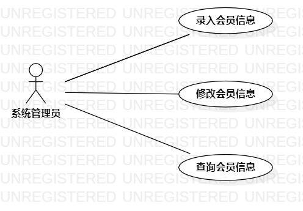

# 实验二：用例建模 #2

## 一、实验内容

1. 细化功能需求。
2. 画出用例图（Use Case Diagram）
3. 编写用例规约（表格）

## 二、实验要求
1. 给每一个功能点写一段描述（字数至少60字，3行）
2. 写清楚使用功能的用户
3. 说明该功能执行之后产生的结果
4. 用例规约必填：基本流程（成功执行用例的步骤）；扩展流程（引起用例失败的步骤）

## 三、实验步骤

1. 确定选题（超市会员管理系统）
2. 确定角色（系统管理员）
3. 确定管理员功能（录入会员信息、修改会员信息、查询会员信息)
4. 描述管理员功能
5. 画出用例图
6. 编写用例条例规约

## 四、实验结果

  
图1： 管理员功能用例图

表1：录入会员信息用例规约

用例编号 | UC01 | 备注 |
:- | :- | :- | 
用例名称 | 录入会员信息 | 
前置条件 | 1.管理员已登录 | 必要|
~ | 2.会员个人信息已收集 | 必要|
后置条件 | 系统保存会员信息 |  |
基本流程 | 1.管理员点击录入会员信息按钮 |录入会员信息成功|
~ | 2.系统弹出会员信息登记界面 |
~ | 3.管理员输入会员信息后点击添加按钮 |
~ | 4.系统检查必要信息已全部填写，保存会员信息 |
~ | 5.系统显示添加成功并跳转到会员信息列表，显示刚刚添加的记录 |
扩展流程 | 4.1 系统检查发现会员信息缺少必要信息，提示“必要信息没有填写完整” | 录入会员信息失败 |

表2：修改会员信息用例规约

用例编号 | UC02 | 备注 |
:- | :- | :- | 
用例名称 | 修改会员信息 | 
前置条件 | 1.管理员已登录 | 必要|
~ | 2.会员个人信息已录入  | 必要|
后置条件 | 系统更新会员信息 |  |
基本流程 | 1.管理员点击修改按钮 |修改会员信息成功|
~ | 2.系统弹出会员信息界面 |
~ | 3.管理员修改会员信息，修改完点击修改按钮 |
~ | 4.系统检查修改的信息符合要求，更新会员信息 |
~ | 5.系统显示修改成功并跳转到会员信息列表，显示刚刚修改的记录 |
扩展流程 | 4.1 系统检查修改部分不符合要求，提示“修改信息有误” | 修改会员信息失败 |

表3：查询会员信息用例规约

用例编号 | UC03 | 备注 |
:- | :- | :- | 
用例名称 | 查询会员信息 | 
前置条件 | 1.管理员已登录 | 必要|
~ | 2.会员个人信息已录入   | 必要|
后置条件 | 系统显示会员信息 | |
基本流程 | 1.管理员输入会员手机号码 |查询会员信息成功|
~ | 2.管理员点击查询按钮 |
~ | 3.系统查询会员信息表，找到会员信息 |
~ | 4. 系统显示找到的会员信息 |
扩展流程 | 3.1 系统查询不到该会员，提示“该会员不存在” | 查询会员信息失败 |

