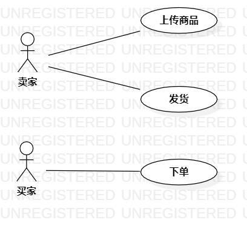

# 实验二:用例建模

## 一、实验目标

1. 掌握UML工具建立用例图；  
2. 掌握用例规约表的使用。

## 二、实验内容

1. 确定选题并提交到issue；  
2. 创建选题内容的用例图；  
3. 编写用例规约表。

## 三、 实验步骤  

1. 选题为“小区微商管理系统”
2. 确定参与者(Actor):  
      - 卖家
      - 买家
3. 确定功能:   
      - 卖家上传商品信息
      - 卖家发货
      - 买家下单
4. 创建用例图(Lab2_UseCaseDiagram)
5. 编写用例规约

## 四、实验结果  

  
图1.小区微商管理系统用例图  

## 表1：上传商品用例规约  

用例编号  | UC01 | 备注  
-|:-|-  
用例名称  | 上传商品信息  |   
前置条件  | 卖家已登录系统   |    
后置条件  | 系统保存卖家上传的商品信息   |    
基本流程  | 1. 卖家点击“上传商品”按钮；  |*用例执行成功的步骤*    
~| 2. 系统提示输入商品信息；  |   
~| 3. 卖家输入商品信息，点击“上传”按钮；  |   
~| 4. 系统检查信息按规定填写。  |    
~| 5. 系统保存商品信息，显示“商品已上传”。  |
扩展流程  | 4.1 系统检查发现未完善所有信息，提示“请完善必填信息后重新点击上传”；  |*用例执行失败*    
~| 4.2 系统检查发现该卖家已上传同一商品，提示“请勿重复上传该商品”。  |  

## 表2：发货用例规约  

用例编号  | UC02 | 备注  
-|:-|-  
用例名称  | 发货  |   
前置条件  | 卖家已登录系统   |    
后置条件  | 买家收到商品后付款    |    
基本流程  | 1. 卖家点击“发货”按钮；  |*用例执行成功的步骤*    
~| 2. 系统显示已下单买家的地址和商品信息；  |   
~| 3. 卖家准备商品并发货；  |   
~| 4. 系统实时更新订单状态。  |    
~| 5. 卖家到达买家地址点击“已送达”按钮；  |   
~| 6. 系统确认卖家当前位置相符合；  |   
~| 6. 系统保存此时订单状态，显示“订单已完成”。  |   
扩展流程  |  6.1 系统检查发现卖家位置与买家地址不符合，提示“当前位置非收货地址”  |*用例执行失败*     

## 表3：下单用例规约  

用例编号  | UC03 | 备注  
-|:-|-  
用例名称  | 下单  |   
前置条件  | 买家已登录系统   |    
后置条件  | 系统保存下单内容，生成订单。     |    
基本流程  | 1. 买家点击“下单”按钮；  |*用例执行成功的步骤*    
~| 2. 系统显示商品及其信息；  |   
~| 3. 买家选择要下单的商品后，点击“收货地址”按钮；  |   
~| 4. 系统显示填写收货地址；  |    
~| 5. 买家填写收货地址，点击“确认下单”按钮；  |    
~| 6. 系统保存订单内容，显示“已下单”。  |   
扩展流程  | 3.1 系统检查发现买家所选择的商品库存不足，提示“所选商品库存不足，请重新选择”；  |*用例执行失败*    
~| 5.1 系统检查发现收货地址不合理，提示“该地址有误，确认是否在小区内”。  |  
