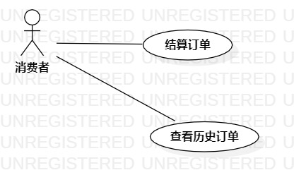

# 实验二：用例建模
## 一、实验目标
1. 学会画用例图
2. 学会编写用例规约
## 二、实验内容
1. 确定个人建模选题，将选题填写在 Issues 中：
https://github.com/hzuapps/uml-modeling-2020/issues
2. 细化功能需求
3. 画出用例图（Use Case Diagram）
4. 编写用例规约
## 三、实验步骤
1. 在 https://github.com/hzuapps/uml-modeling-2020/issues 上提交个人选题
2. 使用 StarUML 画选题的用例图
3. 编写用例规约
## 四、实验结果
选题：商城支付系统（#921）
1. 结算订单：对订单中的商品进行结算
2. 查询历史账单：查看自己一段时间内的所有订单

  
图1：商城支付系统用例图

## 五、用例规约
### 表1：查看新闻用例规约  

用例编号  | UC01 | 备注  
-|:-|-  
用例名称  | 订单结算 |   
前置条件  | 消费者已经登陆，其商品已经选完形成订单 |    
后置条件  | 完成订单结算 |    
基本流程  | 1. 消费者点击已经存在的订单 |   用例执行成功步骤
~| 2. 页面显示订单的详细内容 |
~| 3. 消费者检查订单 |
~| 4. 消费者点击支付按钮 |
~| 5. 消费者选择支付方式，点击支付 |
~| 6. 跳转到支付页面 |
~| 7. 输入支付密码  |
~| 8. 系统检查支付密码 |
~| 9. 系统检查到余额是否充足 |
~| 10. 系统检查支付已到帐 |
~| 11. 订单支付完成
扩展流程  | 8.1 系统检查到支付密码不正确，提示"您输入的支付密码错误,请重新输入" | 用例执行失败
~|  9.1 系统检测到消费者余额不足，提示"您的余额不足,请先充值" |

### 表2：查询历史账单用例规约  

用例编号  | UC02 | 备注  
-|:-|-  
用例名称  | 查询历史账单 |   
前置条件  | 消费者已经登陆 |    
后置条件  | 页面显示消费者的历史订单列表 |    
基本流程  | 1. 消费者点击查询订单按钮 |  用例执行成功步骤  
~| 2. 消费者输入隐私密码 |
~| 3. 系统检查隐私密码 |   
~| 4. 系统搜索该消费者的所有订单 |
~| 5. 显示搜索到的历史订单列表 |
扩展流程  | 3.1 系统检查到消费者输入的隐私密码不正确,提示"您输入的隐私密码不正确,请重新输入" | 用例执行失败
