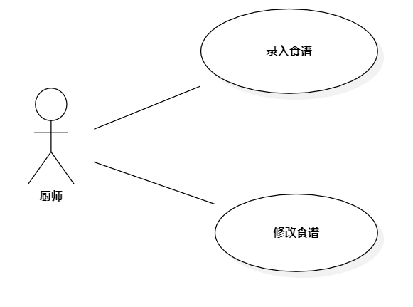

# 实验二：用例建模

## 一、实验目标
1.创建并完善选题

2.了解并掌握用例图的画法

3.通过github提交实验文档

## 二、实验内容
1.建立个人选题项目

2.根据自己的项目运用UMLStar绘制用例图

3.用git操作提交本次实验

## 三、实验步骤
1. 选题为布匹批发系统
2. 根据issues在StarUML上创建用例图（Lab2_UseCaseDiagram）
3. 确定参与者（Actor）:  
      - 厨师   
4. 确定用例（UserCase）:   
      - 录入新的菜谱
      - 修改菜谱
5. 建立Actor和UserCase之间的联系
6. 绘画用例图（lab02UseCaseDiagram）
7. 编写用例规约

## 四、实验结果

 

图1：厨房食谱管理系统的用例图

## 表1：录入新的食谱用例规约
用例编号  | UC01 |   
-|:-|
用例名称  | 录入食谱  |   
前置条件  | 厨师登录厨房食谱管理系统 |
后置条件  |    系统显示食谱选择页面   |
基本流程  | 1. 厨师点击食谱录入按钮;  |
~| 2. 系统显示食谱录入页面;  |  
~| 3. 厨师录入食谱，点击录入按钮；  |   
~| 4. 系统检查食谱是否存在; |   
~| 5. 系统保存食谱; |
~| 6. 系统提示“录入食谱成功”; |
~| 7. 系统显示食谱选择页面。  | 
扩展流程  | 4.1 系统检查发现食谱已存在，提示“该食谱已存在，请重新录入食谱”; |
## 表2：修改食谱用例规约
用例编号  | UC02 | 
-|:-|
用例名称  | 修改食谱  |   
前置条件  | 厨师登录厨房食谱管理系统 |
后置条件  | 系统显示食谱选择页面 |
基本流程  | 1. 厨师点击食谱修改按钮;  |
~| 2. 系统显示食谱修改页面;  |  
~| 3. 厨师修改食谱，点击保存按钮；  |   
~| 4. 系统检查食谱是否发生改动;  |
~| 5. 系统保存食谱; | 
~| 6. 系统提示“修改食谱成功”。 |
~| 7. 系统显示食谱选择页面。  | 
扩展流程  | 4.1 系统检查发现食谱未发生改动，提示“食谱未发生改动，请重新录入食谱”; |