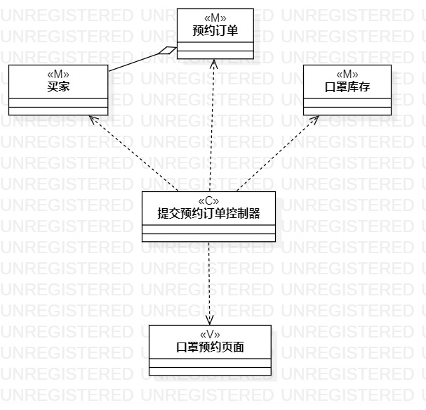

# 实验四&五：类建模

## 一、实验目标

1.掌握类建模方法；

2.了解MVC或你熟悉的设计模式；

3.掌握类图的画法。

## 二、实验内容

1.基于MVC模式设计类；

2.设计类的关系；

3.画出类图。

## 三、实验步骤

1.创建“提交个人信息”类项目：

- 创建提交个人信息控制器类图、口罩买家个人信息类图、提交个人信息页面类图和小程序首页类图。
- 用依赖线分别连接提交个人信息控制器类图与其他各类图。

2.创建“提交口罩预约订单”类项目：

- 创建提交口罩预约订单控制器类图、口罩买家个人信息类图、口罩预约订单类图、各门店口罩库存类图、各门店地址信息类图、口罩预约页面类图和订单信息页面类图。
- 用依赖线连接提交口罩预约订单控制器类图与其他各类图；再用聚合线连接口罩买家个人信息类图与口罩预约订单类图、各门店地址信息类图与口罩预约订单类图。

## 四、实验结果

  

图1 提交个人信息类图

图1说明：由于是小程序，可根据自动获取的微信openId来区分口罩买家的身份，并与提交的个人信息合为一个类。因此并没有单独的登录账号类。

     

图2 提交口罩预约订单类图

图2说明：各门店口罩库存类图只用于检查门店口罩数量和进行数据操作，并没有与口罩预约订单类图有聚合关系。

