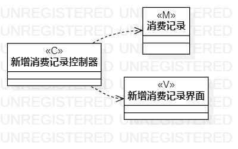
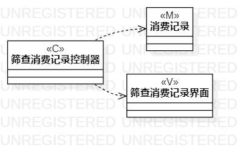

# 实验四&五 类建模

## 实验目标
1. 掌握类建模方法；
2. 了解MVC或你熟悉的设计模式；
3. 掌握类图的画法。（Class Diagram）

## 实验内容
1. 基于MVC模式设计类；
2. 设计类的关系；
3. 画出类图。

## 实验步骤
1. 修改实验三的活动图
2. 查看实验二用例规约
3. 根据用例规约画出系统类图
4. 编写实验报告

## 实验结果
  
图1.新增消费明细类图

  
图2.筛查消费记录类图

## 实验笔记
1. MVC设计模式
- M(Model) 即对数据库的操作模型
- V(View) 即人机交互的界面
- C(Controller) 即系统后台的控制器  
2. 类图间的五种关系
- 依赖关系 当一个类的对象与另一个类的对象短暂交互工作时所使用，是最弱的类之间的关系
- 组合关系 当一个类的对象与另一个类的对象较长时间的交互工作时所使用
- 聚合关系 当一个类拥有但与另一个类对象的引用共享时所使用
- 组成关系 当一个类包含另一个类的对象时所使用
- 继承关系 当一个类是另一个类的其中一个类型时所使用，是类之间最强的关系
