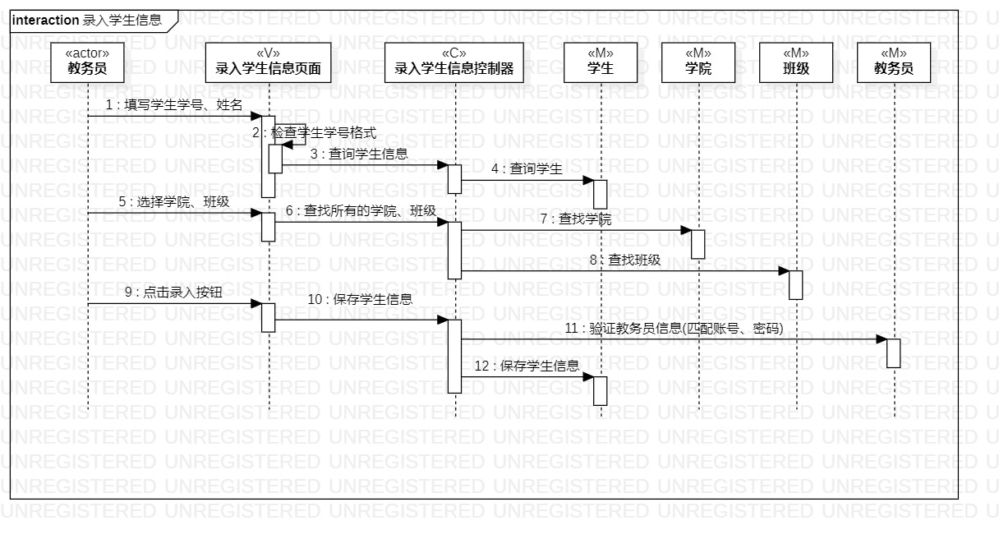
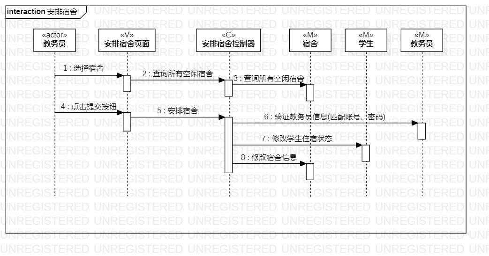

# 实验六：交互建模

## 一、实验目标

1. 理解系统交互
2. 掌握UML顺序图的画法
3. 掌握对象交互的定义与建模方法

## 二、实验内容

- 根据用例模型和类模型，确定功能所涉及的系统对象；
- 在顺序图上画出参与者（对象）；
- 在顺序图上画出消息（交互）；

## 三、实验步骤

根据自己的用例模型和类模型，确定功能所涉及的系统对象,画出顺序图：

1.创建第一个顺序图（录入学生信息顺序图）

&emsp;(1) 创建生命线：

&emsp;&emsp;actor类型的“教务员”、view类型的“录入学生信息页面”、control类型的“录入学生信息控制器”、model类型线“学生”“学院”“班级”“教务员”；

&emsp;(2) 根据用例规约的流程，为生命线添加message的通信: 

&emsp;&emsp;1：填写学生学号、姓名(教务员——>录入学生信息界面);  
&emsp;&emsp;2：检查学生学号格式(录入学生信息界面——>录入学生信息界面);   
&emsp;&emsp;3：查询学生信息(录入学生信息界面——>录入学生信息控制器);    
&emsp;&emsp;4：查询学生(录入学生信息控制器——>学生);  
&emsp;&emsp;5：选择学院、班级(教务员——>录入学生信息界面);  
&emsp;&emsp;6：查找所有的学院、班级(录入学生信息界面——>录入学生信息控制器);  
&emsp;&emsp;7：查找学院(录入学生信息控制器——>学院);    ;   
&emsp;&emsp;8：查找班级(录入学生信息控制器——>班级);  
&emsp;&emsp;9：点击录入按钮(教务员——>录入学生信息界面);  
&emsp;&emsp;10：保存学生信息(录入学生信息界面——>录入学生信息控制器);   
&emsp;&emsp;11：验证教务员信息(匹配账号、密码)(录入学生信息控制器——>教务员);  
&emsp;&emsp;12：保存学生信息(录入学生信息控制器——>学生);    

2.创建第一个顺序图（安排宿舍顺序图）

&emsp;(1) 创建生命线： 

&emsp;&emsp;actor类型的“教务员”、view类型的“安排宿舍页面”、control类型的“安排宿舍控制器”、model类型线“宿舍”“学生”“教务员”；

&emsp;(2) 根据用例规约的流程，为生命线添加message的通信: 

&emsp;&emsp;1：选择宿舍(教务员——>安排宿舍页面);  
&emsp;&emsp;2：查询所有空闲宿舍(安排宿舍页面——>安排宿舍控制器);  
&emsp;&emsp;3：查询所有空闲宿舍(安排宿舍控制器——>宿舍);  
&emsp;&emsp;4：点击提交按钮(教务员——>安排宿舍页面);  
&emsp;&emsp;5：安排宿舍(安排宿舍页面——>安排宿舍控制器);  
&emsp;&emsp;6：验证教务员信息(匹配账号、密码)(安排宿舍控制器——>教务员);   
&emsp;&emsp;7：修改学生住宿状态(安排宿舍控制器——>学生);  
&emsp;&emsp;8：修改宿舍信息(安排宿舍控制器——>宿舍);   

## 四、实验结果

### 1. 顺序图

图1. 录入学生信息顺序图

图2. 安排宿舍顺序图

## 五、实验心得
&emsp;&emsp;通过本次学习的顺序图，我能够对顺序图有一定的了解，顺序图描述类系统中类和类之间的交互，它将这些交互建模成消息交换。顺序图是一个模型，用于描述对象间如何随着时间在某些行为方面进行协作。我能够清晰的理清我的用例的基本流程，同时对过去的实验进行修改。