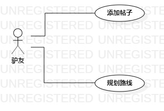

# 实验二：用例建模

## 一、实验目标

1.使用StarUML画用例图

2.编写用例规约

## 二、实验内容

1.画出个人选题的用例图

2.在实验报告中编写用例规约

## 三、实验步骤

- 根据个人选题确认参与者与用例

- 个人选题：游玩通
- 确定参与者（用户）：
  - 驴友
- 确定用例（功能需求）：
  - 添加帖子
  - 规划路线
- 把参与者和用例连起来
- 画出用例图（Lab2_UseCaseDiagram）
- 将用例图以JPG格式导出
- 编写实验报告文档
- 编写用例规约

## 四、实验结果

### 1、UML图

图1：游玩通用例图

### 2、用例规约表

#### 表1：添加帖子用例规约

用例编号  | UC01 | 备注  
-|:-|-  
用例名称  | 添加帖子 |   
前置条件  | 驴友登录进入游玩通   | *可选*   
后置条件  |   驴友发布帖子   | *可选*   
基本流程  | 1. 驴友点击添加新帖子 |*用例执行成功的步骤*    
~| 2. 系统显示帖子信息编辑页面 |   
~| 3. 驴友输入帖子具体信息，点击提交按钮 |   
~| 4. 系统检查帖子内容，没有不恰当词汇，保存帖子内容 |   
~| 5. 系统显示“添加成功”，返回帖子首页 |  
扩展流程  | 3.1 帖子内容为空，不予提交，提示帖子内容不能为空 |*用例执行失败*    
~| 4.1 系统检查发现有不恰当词汇，不予通过，提示含有不恰当词汇 | 

#### 表2：规划路线用例规约

用例编号  | UC02 | 备注  
-|:-|-  
用例名称  | 规划路线 |   
前置条件  | 驴友登录进入游玩通   | *可选*   
后置条件  | 驴友查看路线 | *可选*   
基本流程  | 1. 驴友点击路线规划 |*用例执行成功的步骤*    
~| 2. 系统显示地点选择 |   
~| 3. 驴友选择不同地点，点击提交 |   
~| 4. 系统计算距离和费用设计出最优路线 |   
~| 5. 系统显示最优路线信息 | 
扩展流程  | 4.1 所选择地点无法构成路线，提示规划失败 |*用例执行失败*    
~|    | 

