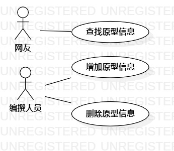

# 实验目标
- 画出用例图。
- 编写用例规约。
# 实验内容
## 1.确认选题为角色原型信息系统
## 2.根据选题绘制用例图
- 确定人员
- 确定用例
- 建立人员和用例的连接
## 3. 编写用例规约
# 实验结果

   
 图1 角色原型信息系统用例图
 
 ## 表1：查找原型信息用例规约  

用例编号  | C1 | 备注  
-|:-|-  
用例名称  | 查找原型信息  |   
前置条件  | 网友进入系统首页    |  
后置条件  |  |   
基本流程  | 1.网友点击搜索框  |*用例执行成功的步骤*  
~| 2.网友输入搜索内容并点击搜索按钮  |
~| 3.系统查询到结果，返回原型信息标题列表   |   
~| 4. 网友点击原型信息标题  |   
~| 5. 系统跳转到原型信息页面  |   
扩展流程  | 3.1 系统查无相关内容，返回空标题列表 | 

## 表2：增加原型信息用例规约  

用例编号  | C2 | 备注  
-|:-|-  
用例名称  | 增加原型信息  |   
前置条件  | 编撰人员进入编撰页面    |    
后置条件  |      |  
基本流程  | 1. 系统返回原型信息列表  |*用例执行成功的步骤*  
~| 2. 编撰人员点击增加按钮；  |  
~| 3. 编撰人员编写并提交角色原型信息的内容  |   
~| 4. 系统检测无重名标题，保存角色原型信息  | 
扩展流程  | 4.1 系统检测有重名标题，提示“重名标题” | *用例执行失败的步骤*  
~| 4.2 系统跳转回编撰界面  | 

## 表3：删除原型信息用例规约

用例编号  | C3 | 备注  
-|:-|-  
用例名称  | 删除原型信息  |   
前置条件  | 编撰人员进入编撰界面    | 
后置条件  |      |   
基本流程  | 1. 系统返回原型信息列表  |*用例执行成功的步骤*  
~| 2. 编撰人员点击点击删除按钮  |   
~| 3. 系统弹出确认框  |
~| 4. 编撰人员点击确认按钮，系统删除角色原型信息  |   
扩展流程  | 4.1 编撰人员点击取消按钮，系统跳转回编撰界面 | 

