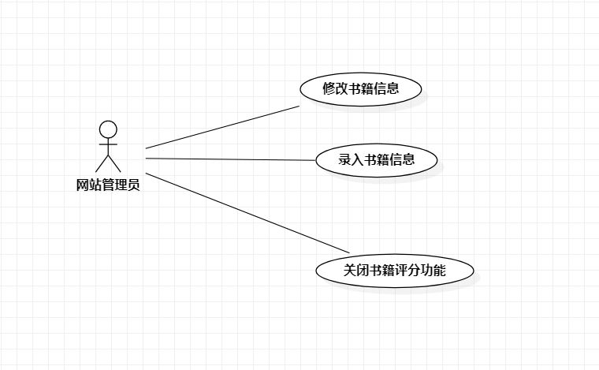
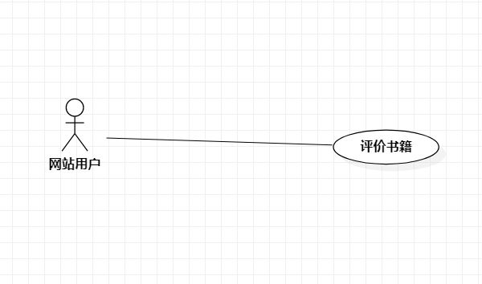

# 实验二：用例建模

## 1. 实验内容

- 细化功能需求。
- 画出用例图（Use Case Diagram）
- 编写用例规约（表格）

## 2. 实验要求

- 给每一个功能给每一个功能点写一段描述（字数至少60字，3行）
- 写清楚使用功能的用户
- 说明该功能执行之后产生的结果
-  用例规约必填：基本流程（成功执行用例的步骤）；扩展流程（引起用例失败的步骤）

## 3. 实验步骤

- 确定选题（IT书籍推荐系统）

- 确定角色（用户、管理员）

- 确定用户功能（给书籍评分)
- 确定管理员功能（录入书籍信息）

- 编写上述两个功能点的描述

- 为上述两个功能点画出用例图

- 编写上述两个功能的条例规约

## 4. 实验结果

- 管理员录入书籍信息：管理员登录后，点击录入书籍信息按钮跳转至书籍信息录入页面，在再填写上架书籍所必须的信息后，点击上架按钮完成书籍录入。

-  用户评分：用户进行登录后，点击正在浏览的书籍的评分按钮，对书籍进行评分。

   

 图1：管理员录入书籍信息

## 表1：管理员录入书籍信息用例规约
| 用例编号 | UC01                                                         | 备注         |
| :------- | :----------------------------------------------------------- | :----------- |
| 用例名称 | 录入书籍信息                                                 |              |
| 前置条件 | 管理员已登录                                                 |              |
| 后置条件 | 系统已保存书籍信息                                           | 必要         |
| 基本流程 | 1.管理员点击录入书籍信息按钮                                 |              |
| ~        | 2.系统跳转录入书籍信息页面                                   |              |
| ~        | 3.管理员输入书籍信息后点击发布按钮                           |              |
| ~        | 4.系统检查必要信息已全部填写，保存书籍信息                   |              |
| ~        | 5.系统跳转到书籍列表页面                                     |              |
| 扩展流程 | 4.1 系统检查发现书籍缺少必要信息，提示“必要信息没有填写完整” | 录入书籍失败 |
|          | 4.2系统返回录入书籍页面，提示"请补充书籍信息"                |              |

  

 图2：网站用户评价书籍用例图

## 表2：用户对书籍评分用例规约

| 用例编号 | UC02                                                         | 备注         |
| :------- | :----------------------------------------------------------- | :----------- |
| 用例名称 | 评价书籍                                                     |              |
| 前置条件 | 用户已在书籍详情页                                           |              |
| 后置条件 |                                                              |              |
| 基本流程 | 1.用户点击书籍评分按钮                                       |              |
| ~        | 2.系统弹出书籍评分窗口                                       |              |
| ~        | 3.用户对在评分窗口输入评语并点亮评分的星星。                 |              |
| ~        | 4.系统检查星星数量是否符合要求，若符合则保存评语与星星数量。 |              |
| ~        | 5.系统跳转书籍详情页                                         |              |
| 扩展流程 | 4.1 系统检查发现星星数量少于1，提示“最低评分为1星”           | 评价书籍失败 |
|          | 1.1 用户未登录，提示“用户未登录”                             |              |

