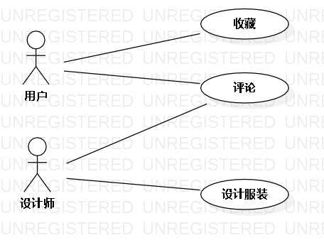

# 实验二：用例建模

## 一、实验内容

1. 使用Markdown编写报告
2. 细化选题
3. 学习使用StarUML用例建模

## 二、实验内容

1. 创建用例图
2. 编写实验报告文档
3. 编写用例规约

## 三、实验步骤  

1. 选题为服装设计系统
2. 根据选题使用startuml绘制用例图
3. 新建UseCaseDiagram
4. 创建两个角色（Actor）：用户、设计师
5. 创建三个用例（UseCase）：收藏、评论、设计服装
6. 确定角色与用例之间的联系：用户----收藏、评论；设计师----评论、设计服装
7. 导出为jpg图片
8. 编写用例规约

## 四、实验结果

图1：服装设计系统用例图

## 表1、收藏用例规约

用例编号  | UC01 | 备注  
-|:-|-  
用例名称  | 收藏  |   
前置条件  | 用户进入查看作品界面     | *可选*   
后置条件  | 系统弹出收藏状态界面     | *可选*   
基本流程  | 1.用户点击作品界面上的收藏按钮  |*用例执行成功的步骤*    
~| 2.系统弹出询问放入哪个收藏夹  |   
~| 3.用户选择一个收藏夹并点击确定   |   
~| 4. 系统检查该收藏夹中无此作品  |
~| 5.系统保存作品  |
~| 6.弹出收藏作品成功  |
扩展流程  | 4.1 系统检查发现收藏夹中已有该作品  |*用例执行失败*    
~| 4.2  系统弹出收藏失败已收藏该作品 |  

## 表2、评论用例规约

用例编号  | UC02 | 备注  
-|:-|-  
用例名称  | 评论  |   
前置条件  | 用户进入作品界面     | *可选*   
后置条件  | 系统展示评论更新后的界面     | *可选*   
基本流程  | 1.用户点击作品界面上的评论按钮  |*用例执行成功的步骤*    
~| 2.系统弹出已有评论及评论输入框  |   
~| 3.用户点击输入框输入评论并提交   |   
~| 4.系统检查评论无敏感词汇  |
~| 5.系统保存评论  |
~| 6.系统弹出评论成功  |
扩展流程  | 4.1 系统检查发现评论含有敏感词汇  |*用例执行失败*    
~| 4.2  系统弹出提示含敏感词汇评论失败 |  

## 表3、设计服装用例规约

用例编号  | UC03 | 备注  
-|:-|-  
用例名称  | 设计服装  |   
前置条件  | 设计师进入服装设计界面     | *可选*   
后置条件  | 系统进入服装预览界面     | *可选*   
基本流程  | 1.设计师点击‘进入设计’按钮  |*用例执行成功的步骤*    
~| 2.系统进入设计面板  |   
~| 3.设计师设计作品完成设计后提交   |   
~| 4.系统进入作品预览界面  |
~| 5.设计师确定后点击确定按钮提交作品  |
~| 6.系统检测作品无敏感图案或设计  |
~| 7.系统保存作品  |
~| 8.系统弹出提交成功  |
扩展流程  | 6.1 系统检测发现作品存在敏感图案或设计  |*用例执行失败*    
~| 6.2 系统弹出提示存在敏感图案提交失败   |  

