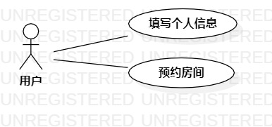

# 实验二：用例建模

## 一、实验目标

1.使用Markdown编写用例建模实验报告；

2.理解选题功能实现步骤；

3.学习使用StarUML建模；

4.学习用例规约标准；

## 二、实验内容

1.用例建模；

2.编写用例规约；

3.编写实验二文档；

## 三、实验步骤

1.选题：宾馆预约系统；

2.创建用例图；

3.确定参与者：  用户

4.确定用例：
  	  - 填写个人信息
      - 预约房间
5.绘制用例图
6.编写用例规约

## 四、实验结果

1.用例图：

## 表1：填写个人信息用例规约

用例编号 | UC01 | 备注
-|:-|-
用例名称 | 填写个人信息 |
前置条件 | | *可选*
后置条件 | | *可选*
基本流程 | 1.用户点击"添加个人信息"按钮; | 
~| 2.系统显示个人信息填写页面; |
~| 3.用户输入个人信息，点击"保存"按钮；|
~| 4.系统检查个人信息完整，并且未发现相同个人信息，保存个人信息 | *用例执行成功*
扩展流程 |4.1 系统检查用户所提交个人信息不完整，提示"提交个人信息不完整"；|*用例执行失败*
~ | 4.2 系统检查用户所提交个人信息完整，但存在相同个人信息，提示"已存在此人"；| *用例执行失败*

## 表2 ：预约房间用例规约

用例编号 | UC02 |备注
-|:-|-
用例名称 | 预约房间 |
前置条件 | 用户已填写个人信息 |
后置条件 | |
基本流程 |1.用户点击"预约房间"按钮；|
~| 2.系统显示房间列表；|
~| 3.用户点击"查看房间"按钮； |
~| 4.系统显示选定房间详细信息； |
~| 5.用户点击"预约房间"按钮； |
~| 6.系统查询选定房间信息，检查房间状态为"空"；|
~| 7.保存用户信息至选定房间，更改房间状态为“已预约”，提示"预约成功" ；|*用例执行成功*
扩展流程 | 6.1 系统查询选定房间信息，检查房间状态为"已预约",提示"预约失败，该房间已被预约"； | *用例执行失败*
