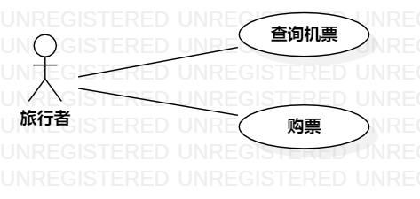

# 实验二   用例建模
## 一、实验目标

1. 学会使用Markdown编写实验报告  
2. 掌握用例的概念和用例建模

## 二、实验内容
1. 提交个人选题到Issues  
2. 用Markdown完成实验报告  
3. 用StartUML完成用例建模  

## 三、实验步骤  
1. 在issues上提交“低价机票查询系统”选题与相关功能：  
- 查询低价航空公司的机票
- 购票
2. 根据选题和所选功能在StarUML上画出用例图：    
- 创建“旅行者”一个参与者
- 创建两个用例
- 建立关系Association
3. 编写用例规约
4. 提交用例图和实验报告

## 四、实验结果

  
图1：低价机票查询系统的用例图

## 表1：查询机票用例规约  

用例编号  | UC01 | 备注  
-|:-|-  
用例名称  | 查询机票 |   
前置条件  |  旅行者进入查询页面  | *可选*   
后置条件  |      | *可选*   
基本流程  | 1.旅行者选择出发地和目的地；  |*用例执行成功的步骤*    
~| 2.旅行者点击查询按钮；  |   
~| 3.系统检测出发地和目的地选择不为空，跳转到查询结果页面；  |  
~| 4.系统显示对应的查询结果；  |  
扩展流程  | 3.1系统检测出发地或目的地选择为空，提示“没有选择出发地或目的地，查询失败。”； |*用例执行失败* 

## 表2：购票用例规约  

用例编号  | UC02 | 备注  
-|:-|-  
用例名称  | 购票 |   
前置条件  |   旅行者进入查询结果页面   | *可选*   
后置条件  |      | *可选*   
基本流程  | 1. 旅行者点击购票按钮；  |*用例执行成功的步骤*    
~| 2. 系统显示购票页面；  | 
~| 3. 旅行者输入个人信息； | 
~| 4. 系统检测个人信息填写符合格式，跳转到支付页面； |  
~| 5. 系统核对支付结果通过，显示订单信息，提示“购票成功”；| 
扩展流程  | 4.1 系统检测个人信息填写不符合格式，提示“填写错误”； |*用例执行失败* 
~| 5.1 系统核对支付结果不通过，提示“支付失败”； |
