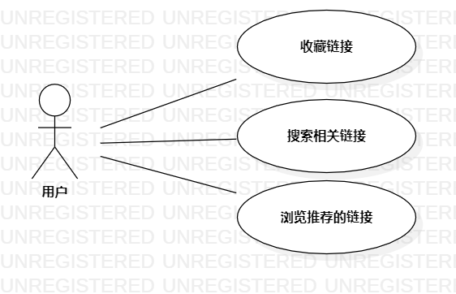

# 实验二：用例建模

## 一、 实验目标

1. 使用Markdown编写报告
2. 细化选题
3. 学习使用StarUML用例建模

## 二、 实验内容

1. 创建用例图
2. 编写实验报告文档
3. 编写用例规约

## 三、 实验步骤

1. 选题为链接收藏系统
2. 根据issue在StarUML上创建用例图（use case）
3. 确定参与者（Actor）:
   - 用户
   - 收藏系统
4. 确定用例（use case）:
   - 复制链接并收藏
   - 搜索相关链接
   - 浏览推荐的链接
5. 建立Actor和use case之间的联系
6. 绘画用例图（use case）
7. 编写用例规约

## 四、 实验结果

1、用例图

### 表1：复制链接并收藏用例规约

| 用例编号 | UC01                                                | 备注                       |
| -------- | --------------------------------------------------- | -------------------------- |
| 用例名称 | 复制链接并收藏                                      |                            |
| 前置条件 | 链接收藏应用系统启动                                |                            |
| 后置条件 | 剪贴板中的内容存在链接                              | 系统监听剪贴板中的内容变化 |
| 基本流程 | 1. 用户打开APP，保持后台运行。                      | 必要                       |
| ~        | 2. 系统判断链接未被当前用户收藏。                   |                            |
| ~        | 3. 系统查询该链接未被其它用户收藏。                 |                            |
| ~        | 4. 使用爬虫爬取该链接的标题。                       |                            |
| ~        | 5. 用户编辑标签并提交。                             |                            |
| ~        | 6. 系统插入该链接，搜索引擎创建索引，创建热门标签。 | 用例执行成功               |
| 扩展流程 | 1.1 检测网络状态，无网络时提示“网络未连接”。        | 用例执行失败               |
|          | 2.1 提示“该链接已收藏”。                            | 用例结束                   |
|          | 3.1 系统查询链接的标题和热门标签。                  |                            |
|          | 3.2 用户修改标签并提交。                            |                            |
|          | 3.3 系统修改热门标签。                              | 用例执行成功               |

### 表2：搜索相关链接用例规约

| 用例编号 | UC02                                                         | 备注           |
| -------- | ------------------------------------------------------------ | -------------- |
| 用例名称 | 搜索相关链接                                                 | 本地、全网搜索 |
| 前置条件 | 链接收藏应用系统启动                                         |                |
| 后置条件 | 应用在前台运行                                               |                |
| 基本流程 | 1. 用户打开APP，保持前台运行。                               | 必要           |
| ~        | 2. 通过下拉框选择本地或者全网搜索。                          |                |
| ~        | 3. 输入关键字。                                              |                |
| ~        | 4. 判断关键字不为空。                                        |                |
|          | 5. 搜索标题或标签匹配关键字的链接。                          |                |
| 扩展流程 | 2.1 进行全网搜索时必须有网络，否则提示“网络未连接”，并只允许本地搜索 |                |
|          | 4.1 提示“关键字不能为空”。                                   |                |

### 表3：浏览推荐的链接用例规约

| 用例编号 | UC03                                                         | 备注 |
| -------- | ------------------------------------------------------------ | ---- |
| 用例名称 | 浏览推荐的链接                                               |      |
| 前置条件 | 链接收藏应用系统启动                                         |      |
| 后置条件 | 用户已关注相关领域或用户手动选择浏览领域                     | 可选 |
| 基本流程 | 1. 用户打开打开“推荐”页面。                                  | 可选 |
| ~        | 2. 点击某一领域的添加（删除）按钮，修改用户的关注信息。      |      |
| ~        | 3. 根据用户关注的领域查询并推送相关的链接，并更新用户本地缓存。 |      |
| ~        | 4. 用户手动选择单个领域后，查询并推送该领域相关的热门链接，并更新用户本地缓存。 |      |
| 扩展流程 | 1.1 若网络错误，提示“网络未连接”，显示最后联网时缓存的相关连接。 |      |
|          | 3.1 用户未关注任何领域，提示“请添加关注的领域”。             |      |
