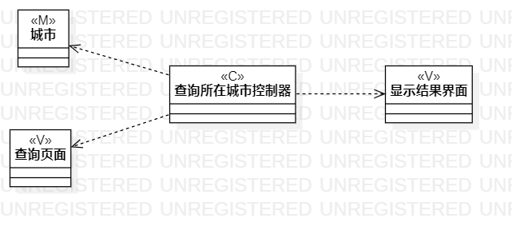

# 实验四、五：类建模

## 1.实验目标：
- 掌握类建模方法；
- 了解MVC或你熟悉的设计模式；
- 了解类的5种关系；
- 掌握类图的画法。（Class Diagram）

## 2.实验步骤：
- 创建类图；
- 根据用例规约的基本流程和扩展流程画类图；
- 根据类之间的关系完成连线；
- 导出为图片，编写实验4报告。

## 3.实验笔记：
- MVC设计模式：M表示模型，实体，数据；V表示视图，界面；C表示控制器，服务类，系统；
- 类的5种关系：从弱到强为：Dependency(依赖)，Association(关联)，Aggregation(聚合)，Composition(组合)，Inheritance(继承)；

    - Dependency(依赖)：用虚线箭头表示；
    - Association(关联): 用实线表示；
    - Aggregation(聚合)：用实线空心菱形箭头表示；
    - Composition(组合)：用实线实心菱形箭头表示；
    - Inheritance(继承)：用实线空心三角形箭头表示。
    
## 4.实验结果

图1.查询所乘坐火车的类图

图2.查询所乘坐飞机的类图

图3.查询所在城市的类图
