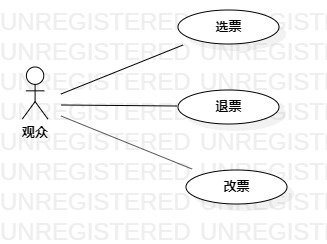

# 实验2
## 实验目标
1. 使用Markdown写报告
2. 细化选题并用例建模
3. 掌握用例图的画法
## 实验内容
1. 确定选题
2. 细化选题并建模
3. 编写用例规约
## 实验步骤
1. 根据issue在StarUML上创建用例图
2. 确定参与者（Actor）:  
    ->观众     
3. 确定用例（use case）:  
    ->选票  
    ->退票  
    ->改票  
4. 建立Actor和use case之间的联系

## 实验结果
  
## 表一：选票用例1规约
用例编号 | UC01 | 备注
-|:-|-
用例名称|选票|
前置条件  |   观众已登录   | *可选*   
后置条件  |      | *可选*
基本流程  | 1. 观众进入选票页面 |   
~| 2. 系统获取比赛信息 |   
~| 3. 观众选定位置并点击提交选票订单 |   
~| 4. 系统检查比赛是否过期  |   
~| 5. 系统检查位置是否已被选用  |
~| 6. 系统写入观众选票订单  |   
~| 7. 系统提示选票成功  |  
扩展流程  | 4.1 系统检查比赛已过期或取消，提示观众选票失败  |*用例执行失败*    
~| 5.1系统检查位置已被选用，提示观众选票失败重新选票  |  

## 表二：退票用例2规约
用例编号 | UC02 | 备注
-|:-|-
用例名称|退票|
前置条件  |   观众已登录   | *可选*   
后置条件  |      | *可选*
基本流程  | 1. 观众进入退票页面 |   
~| 2. 系统获取观众信息 |   
~| 3. 观众选定已选比赛并提交退票订单 |   
~| 4. 系统检查比赛是否过期  |
~| 5. 系统作废原票并释放座位  | 
~| 6. 系统提示退票成功  |  
扩展流程  | 4.1 系统检查比赛已过期或取消，提示观众退票失败  |*用例执行失败*   

## 表二：改票用例3规约
用例编号 | UC03 | 备注
-|:-|-
用例名称|改票|
前置条件  |   观众已登录   | *可选*   
后置条件  |      | *可选*
基本流程  | 1. 观众进入改票页面 |   
~| 2. 系统获取观众信息 |   
~| 3. 观众选定已选比赛并提交改票订单 |   
~| 4. 系统检查比赛是否过期  |   
~| 5. 系统检查位置是否已被选用  |
~| 6. 系统写入新票订单  |  
~| 7. 系统作废原票并释放座位  | 
~| 8. 系统提示改票成功  |  
扩展流程  | 4.1 系统检查比赛已过期或取消，提示观众改票失败  |*用例执行失败*    
~| 5.2 系统检查位置已被选用，提示观众选票失败重新改票  | 

  

