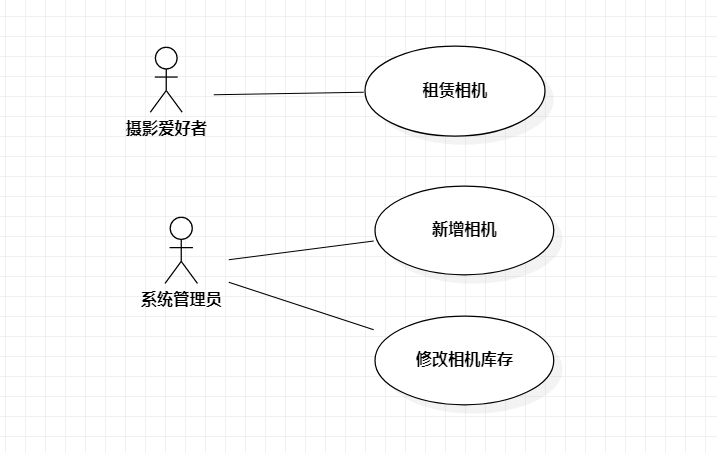

# 实验二

 ## 一、实验目标

 1. 熟悉GitHub操作
2. 创建并完善选题
3. 熟悉StarUML
4. 了解并掌握用例图的画法

 ## 二、实验内容

 1. UML建模选题
2. 在StarUML中画建模用例图
3. 使用Markdown编写实验二报告

 ## 三、实验步骤

1. 确定选题：相机租赁系统
2. 确定用户：摄影爱好者
3. 确定功能：
(1) 新增相机：管理员可以增加相机种类，例如型号，参数等。
(2) 租赁相机：摄影爱好者可以租赁合适的相机。
(3) 修改相机库存：管理员可以修改各个机型的库存
4. 画出选题所需的用例图
(1) 租赁相机
(2) 新增相机
(3) 修改相机库存
5. 撰写实验报告

 ## 四、实验结果

 

 图1：相机租赁系统用例图

## 表1：租赁相机用例规约  

| 用例编号 | uc01                          | 备注                 |
| -------- | :-------------------------- | -------------------- |
| 用例名称 | 租赁相机            |                      |
| 前置条件 | 摄影爱好者登录系统                    | *必须*               |
| 后置条件 |                             | *可选*               |
| 基本流程 | 1. 摄影爱好者选择相机型号，点击租赁按钮;  | *用例执行成功的步骤* |
|          | 2.系统提示输入个人信息和租赁档期;  |                  
|          | 3.摄影爱好者输入个人信息和档期，点击提交按钮;  |                      
|          | 4.系统检测相机库存和档期，保存个人信息和档期;  |                      
|          | 5.系统弹出支付窗口;  |                      
|          | 6.摄影爱好者完成相应支付;  |                      
|          | 7.系统返回“租赁成功”提示信息; |                      
|扩展流程   | 4.1系统检测库存或档期不足;  |                      

## 表2：新增相机用例规约  

| 用例编号 | uc02                                                        | 备注                 |
| -------- | :-------------------------------------------------------- | -------------------- |
| 用例名称 | 新增相机                                                    |                      |
| 前置条件 | 相机管理员已经登录系统                                       | *可选*               |
| 后置条件 |                                                            | *可选*               |
| 基本流程 | 1. 相机管理员点击新增相机按钮；| *用例执行成功的步骤* |
| ~        | 2. 系统显示输入相机相关信息；|                      
| ~        | 3. 相机管理员填写相机参数，数量和价格，点击提交按钮；|                      
| ~        | 4. 系统查询相机信息，检查是否存在，保存相机信息和数量；|                      
| ~        | 5. 系统返回“新增相机成功”提示信息；|                      
|扩展流程   | 4.1系统检测型号已存在，返回“相机型号已存在”提示信息; |  
## 表3：修改相机库存用例规约  

| 用例编号 | uc03                                                        | 备注                 |
| -------- | :-------------------------------------------------------- | -------------------- |
| 用例名称 | 修改相机库存                                                   |                      |
| 前置条件 | 相机管理员进入库存管理系统                                       | *可选*               |
| 后置条件 |                                                            | *可选*               |
| 基本流程 | 1. 相机管理员点击库存修改按钮；| *用例执行成功的步骤* |
| ~        | 2. 系统显示修改界面；|                      
| ~        | 3. 相机管理员填写相机型号和库存数量，点击提交按钮；|                      
| ~        | 4. 系统查询相机型号，检查是否存在；|                      
| ~        | 5. 系统返回“修改库存成功”提示信息；|                      
|扩展流程   | 3.1系统检测相机库存小于最低库存 |
|          | 3.1系统检测相机库存da大于最高库存 |
|          | 4.1系统检测型号不存在，返回“相机型号不存在”提示信息; |     
