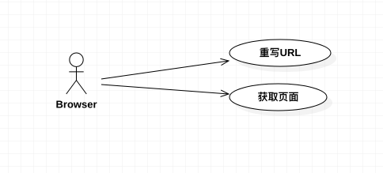

# 实验二：用例建模

## 一、实验目的
1. 继续学习使用markdown编辑实验报告
2. 明确选题
3. 学习StarUML完成用例建模

## 二、实验内容
1. 创建用例图
2. 完成实验报告文档
3. 完成用例规约

## 三、实验步骤
1. 选题为HTTP Server
2. 根据选题创建用例图（Use Case Diagram）
3. 确定参与者（Actor）
    - 客户端
4. 确定用例（Use Case）
    - 允许建立连接
    - 提供HTTP服务
    - 允许关闭连接
5. 建立Actor与Use Case的关联
6. 完成用例规约（Use Case Specification）

## 四、实验结果

### 1. Use Case Diagram

### 2. Use Case Specification

**Specification 1**: 允许建立连接

| 用例编号 | UC01 | 备注 |
| ------- | ---- | --- |
| 用例名称 | 允许建立连接 |  |
| 前置条件 |  | 可选 |
| 后置条件 |  | 可选 |
| 基本流程 | 1. 客户端调用socket创建socket | 用例正常处理流程 |
| ~ | 2. 客户端调用connect发起连接 | |
| ~ | 3. 客户端阻塞并等待服务器响应 | |
| ~ | 4. 连接成功建立 | |
| 拓展流程 | 1.1 系统资源不足，创建失败 | 用例执行异常 |
| ~ | 2.1 connect调用失败 | |
| ~ | 4.1 连接被拒绝 | |

**Specification 2**: 提供HTTP服务

| 用例编号 | UC02 | 备注 |
| ------- | ---- | --- |
| 用例名称 | 提供HTTP服务 |  |
| 前置条件 | 服务器允许建立连接 |  |
| 后置条件 |  |  |
| 基本流程 | 1. 客户端发送HTTP请求 | 用例正常处理流程 |
| ~ | 2. 服务器获取客户端HTTP请求 | |
| ~ | 3. 服务器解析客户端HTTP请求 | |
| ~ | 4. 服务器提供所需的服务内容并发送 | |
| ~ | 5. 服务完成 | |
| 拓展流程 | 1.1 客户端HTTP请求发送失败或超时 | 用例执行异常 |
| ~ | 2.1 服务器获取HTTP请求失败 |  |
| ~ | 3.1 服务器解析HTTP请求失败 |  |
| ~ | 4.1 服务器无法找到资源等，发送相关状态码 |  |

**Specification 3**: 允许关闭连接

| 用例编号 | UC03 | 备注 |
| ------- | ---- | --- |
| 用例名称 | 允许关闭连接 |  |
| 前置条件 |  | 可选 |
| 后置条件 |  | 可选 |
| 基本流程 | 1. 客户端调用close关闭连接 | 用例正常处理流程 |
| ~ | 2. 客户端进入TIME_WAIT状态等待 | |
| ~ | 3. 连接成功关闭并释放资源 | |
| 拓展流程 | 1.1 close调用失败 | 用例执行异常 |
| ~ | 2.1 TIME_WAIT超时，无法确认服务器是否正常关闭 | 设计心跳包机制 |