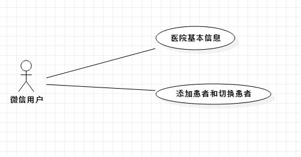

# 实验二

## 一、实验目标

1. 熟悉GitHub操作
2. 创建并完善选题
3. 熟悉StarUML
4. 了解并掌握用例图的画法

## 二、实验内容

1. 使用Markdown完善实验一报告
2. UML建模选题
3. 在StarUML中画建模用例图
4. 使用Markdown编写实验二报告

## 三、实验步骤

1. 在GitHub使用Markdown修改实验一报告文档
2. 确定选题：医院微信公众号系统
3. 确定用户：微信用户
4. 确定功能：
(1) 基本的医院信息：微信用户可以了解该医院的信息
(2) 添加新的病人和切换病人：微信用户可以添加新的患者并且可以通过切换用户来了解属于该用户的信息
5. 用StarUML画用例图，保存为jpg格式
6. 提交用例图到GitHub
7. 在GitHub上编写第二次实验文档

## 四、实验结果

图1: 社区有爱系统的用例图

## 表1： 

| 用例编号 |                            01                             | 备注                 |
| -------- | :-------------------------------------------------------: | -------------------- |
| 用例名称 |                         添加患者                          |                      |
| 前置条件 |                   用户进入添加患者页面                    | *可选*               |
| 后置条件 |                                                           | *可选*               |
| 基本流程 |                  1. 用户点击添加的按钮；                  | *用例执行成功的步骤* |
| ~        |                2. 系统显示动态编辑的页面；                |                      |
| ~        |      3. 用户输入动态的姓名和身份证，点击以添加按钮；      |                      |
| ~        | 4. 系统检查该动态不含敏感词汇，且内容积极向上，保存该动态 |                      |
| ~        |                 5. 系统显示该动态的页面。                 |                      |

## 表2：

| 用例编号 | 02                                      | 备注                 |
| -------- | :-------------------------------------- | -------------------- |
| 用例名称 | 无                                      |                      |
| 前置条件 | 用户进入添加系统继续添加用户            | *可选*               |
| 后置条件 |                                         | *可选*               |
| 基本流程 | 1. 用户点击添加患者的按钮；             | *用例执行成功的步骤* |
| ~        | 2. 判断用户数量是否为上限               |                      |
| ~        | 3. 若是，则提示用户患者数量已经达到上限 |                      |
| ~        | 4. 若不是，则继续让用户添加患者数量     |                      |
|          |                                         |                      |