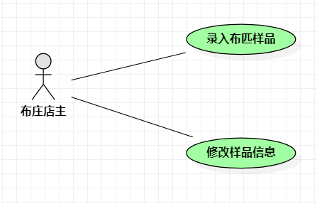

# 实验二：用例建模  

## 一、 实验目标  

1. 使用Markdown编写报告
2. 细化选题
3. 学习使用StarUML用例建模

## 二、 实验内容  

1. 创建用例图
2. 编写实验报告文档
3. 编写用例规约
   
## 三、 实验步骤  
   
1. 选题为布匹样品展览系统
2. 根据issues在StarUML上创建用例图（Lab2_UseCaseDiagram）
3. 确定参与者（Actor）:  
      - 布庄店主   
4. 确定用例（UserCase）:   
      - 录入布匹样品
      - 修改样品信息
5. 建立Actor和UserCase之间的联系
6. 绘画用例图（Lab2_UseCaseDiagram）
7. 编写用例规约
   
## 四、 实验结果  

1. 画图  
  
图1:布匹样品展览系统的用例图

## 表1：录入布匹样品用例规约  

用例编号  | UC01 | 备注  
-|:-|-  
用例名称  | 进入录入布匹样品  |   
前置条件  |  布庄店主进入样品录入页面   | *可选*   
后置条件  |       | *可选*   
基本流程  | 1. 布庄店主导入样品图、填写样品信息，点击录入按钮；   |*用例执行成功的步骤*    
~| 2. 系统查询布匹样品信息，检查未存在相同布匹样品，保存布匹样品信息；  |   
~| 3. 系统显示布匹样品页面   |
扩展流程  | 2.1 系统检查发现布匹样品已经存在，提示布庄店主“该布匹样品已经存在”。 |*用例执行失败*    

## 表2：修改样品信息用例规约  

用例编号  | UC02 | 备注  
-|:-|-  
用例名称  | 修改样品信息  |   
前置条件  |  布庄店主进入布匹样品信息修改页面   | *可选*   
后置条件  |    | *可选*   
基本流程  | 1. 布庄店主修改相关样品信息，点击保存按钮；   |*用例执行成功的步骤*         
~| 2. 系统查询修改后的布匹样品信息，检查未与系统其它已有布匹样品信息雷同，保存布匹样品信息；  |   
~| 3. 系统显示布匹样品页面。  |  
扩展流程  | 2.1 系统检查发现与其它已有布匹样品信息雷同，提示布庄店主“与已有样品信息雷同”；  |*用例执行失败*    
~| 2.2 系统检查发现当前修改与未修改前信息一致，提示布庄店主“此次修改无改动”。  |  

