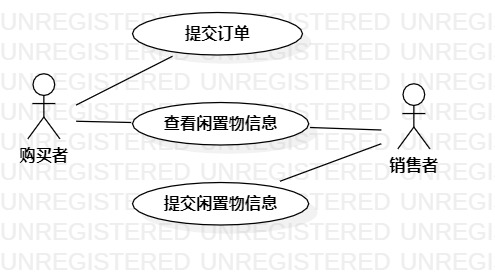

# 实验二

## 一、实验目标

1. Markdown编写文档
2. 确认细化选题
3. 熟悉StarUML建模操作

## 二、实验内容

1. 细化选题功能
2. 创建闲置物出售平台用例图
3. 编写用例规范

## 三、实验步骤

1. 确定选题：#390 闲置物出售平台
2. 完善功能描述:  
(1) 用户能查看闲置物信息（用户包括购买者和销售者）  
(2) 销售者能提交闲置物信息（包括闲置物名称，，闲置物图片，商品描述，价格，交易手段等）    
(3) 购买者能提交闲置物的交易信息

3. 画用例图：  
(1) 参与者： 
- 销售者
- 购买者

(2) 用例：
- 提交闲置物信息
- 查看闲置物信息
- 提交交易信息

## 四、实验结果

1. 绘制用例图

  
图1. 闲置物出售平台用例图

## 表1：提交闲置物信息用例规约  

用例编号  | v01 | 备注  
-|:-|-  
用例名称  | 提交闲置物信息  |   
前置条件  | 销售者登录成功  | *可选*   
后置条件  | 进入个人闲置物页面 | 新添加的闲置物会显示在个人闲置物页面
基本流程  | 1. 销售者点击“新建闲置物”按钮  |*用例执行成功的步骤*    
~| 2. 系统显示闲置物创建页面 |
~| 3. 销售者输入闲置物的名称，商品描述，价格，图片，交易方式等信息 |
~| 4. 点击“创建”按钮 |
~| 5. 系统审核提交闲置物信息 |
~| 6. 系统保存闲置物信息 |
~| 7. 提示“闲置物创建成功”消息框，跳回个人闲置物页面 |  
扩展流程  | 5.1 商品名称，价格，图片等信息为空，显示“输入信息不完整”消息框 |*用例执行失败* 
~| 5.2 有违规词语，显示"检测到有违规词语"消息框 |*用例执行失败* 
~| 5.3 价格为负数或零时，显示"请输入正确价格"消息框 | *用例执行失败* 

## 表2：查看闲置物信息用例规约  

用例编号  | v02 | 备注  
-|:-|-  
用例名称  | 查看闲置物信息  |   
前置条件  | 用户登录成功  | 用户包括购买者和销售者 
后置条件  | 进入闲置物详细信息显示页面 | *可选*   
基本流程  | 1. 用户进入闲置物信息页面 | 没录入关键词时，显示最近发布的若干个闲置物信息
~| 2. 在搜索栏中录入关键词 | 
~| 3. 点击“搜索”按钮 | 
~| 4. 系统检测录入关键词 |
~| 5. 系统搜索并显示含关键词的闲置物 |
~| 6. 点击任一闲置物图片 |
~| 7. 进入闲置物详细信息页面 |
扩展流程  | 3.1 录入关键词为空时，跳回闲置物信息显示页面 | *用例执行失败*  

## 表3：提交交易信息用例规约  

用例编号  | v03 | 备注  
-|:-|-  
用例名称  | 提交交易信息  |   
前置条件  | 购买者登录成功  | *可选*   
后置条件  | 在我的订单页面生成购物单据 | *可选*   
基本流程  | 1. 购买者在闲置物详细信息页面点击“购买”按钮 |*用例执行成功的步骤*    
~| 2. 进入购物信息确认页面 |
~| 3. 用户点击“确认按钮”|
~| 4. 系统生成并保存购物订单|
~| 5. 系统显示购物订单并提示支付|
~| 6. 用户进行支付|
~| 7. 系统检测购物订单支付状态 |
~| 8. 生成并保存购物单据 |
~| 9. 显示“交易成功”页面 |
扩展流程  | 7.1 未完成支付时，跳回闲置物详细信息页面 |
 
