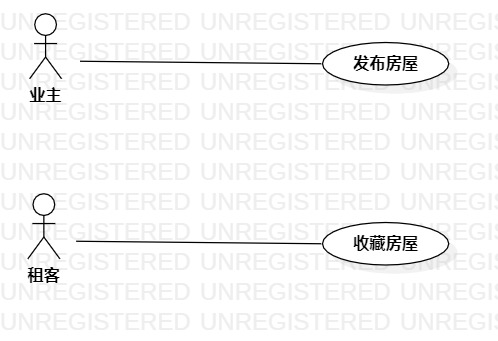

# 实验二：用例建模
## 1.实验目标
- 掌握用例图画法
- 掌握用例规约
## 2.实验内容
- 确定选题
- 创建选题的用例图
- 编写用例规约
## 3.实验步骤
- 确定功能：  
（1）业主发布出租信息  
（2）租客收藏房源
- 画出参与者：业主和租客
- 画出用例
- 建立参与者和用例的联系
- 编写用例规约
## 4.实验结果
  
房屋出租系统的用例图  

# 用例规约的编写

## 表1：发布出租信息用例规约  

用例编号  | UC01 | 备注  
-|:-|-  
用例名称  | 发布出租信息  |   
前置条件  |  业主已经登录进入房屋出租系统    |    
后置条件  |      |    
基本流程  | 1. 业主点击发布信息按钮 |    
~| 2. 系统显示房屋信息发布界面 |   
~| 3. 业主填写房屋的价格，地址，租期，外观等信息并且留下自己的联系电话  |   
~| 4. 业主点击发布按钮|  
~| 5. 系统检查业主的必填内容，必填内容不为空| 
~| 6. 系统查询业主信誉值， 信誉值高于60，保存出租信息 |   
~| 7. 系统提示“发布成功”|  
扩展流程  | 5.1  系统检查业主的必填内容，必填内容为空，提示“必填内容为空，无法发布” | 
~| 6.1  系统查询业主信誉值，发现业主信誉值低于60，提示“你的信誉值过低，无法发布” | 

## 表2：收藏房源用例规约  

用例编号  | UC02 | 备注  
-|:-|:--  
用例名称  | 收藏房源  |   
前置条件  |   租客已经登录进入房屋出租系统   |    
后置条件  |      |    
基本流程  | 1. 租客点击收藏按钮 |    
~| 2. 系统显示收藏页面 |   
~| 3. 租客选择感兴趣的房源，点击完成按钮  |
~| 4. 系统查询租客已收藏的房源，检查不存在编号相同的房源，更新租客收藏的房源信息  |  
~| 5. 系统提示“收藏成功”  | 
扩展流程  | 4.1 系统查询租客已收藏的房源，发现存在编号相同的房源，提示“此房源已收藏”  | 
