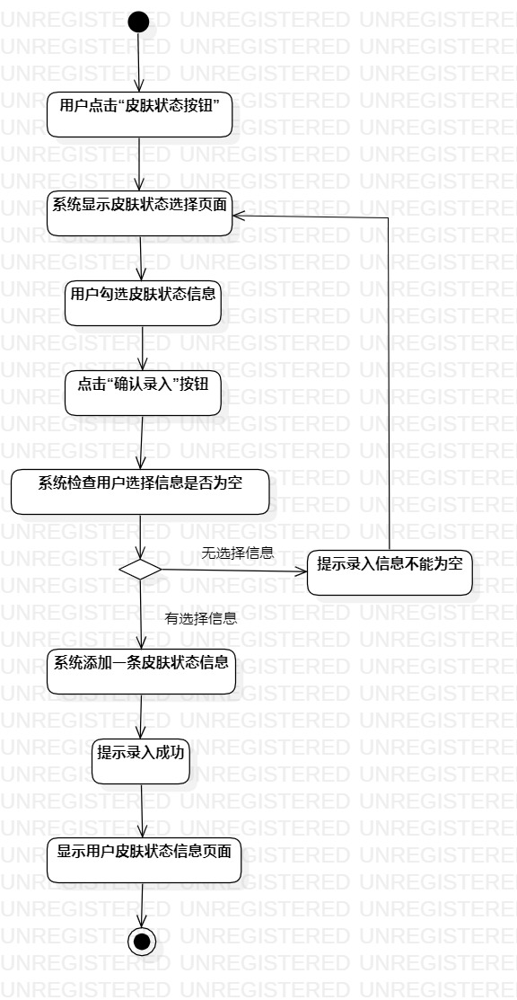
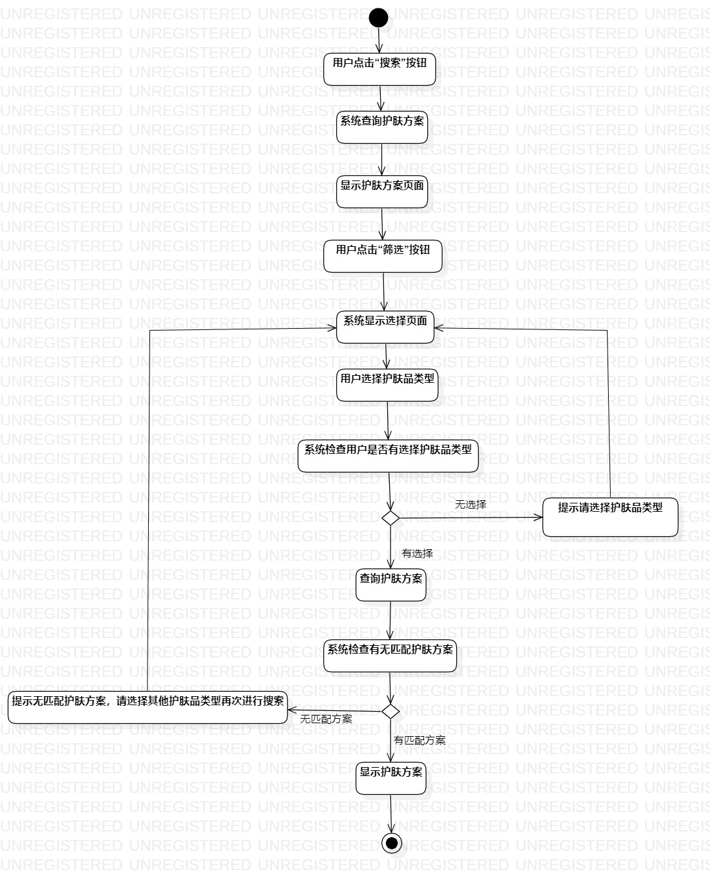
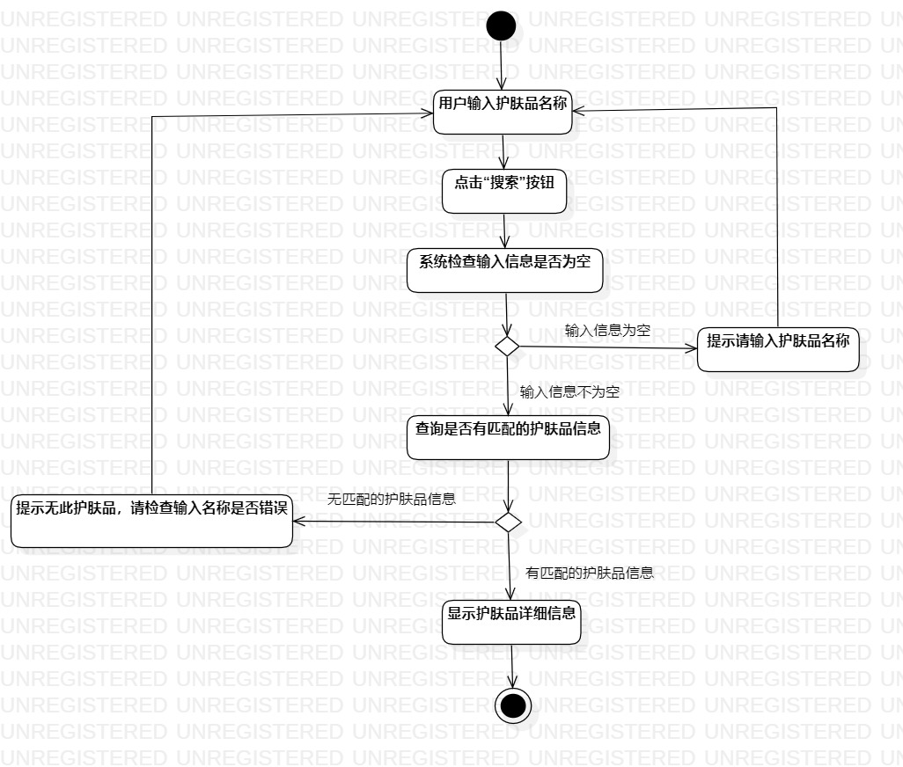
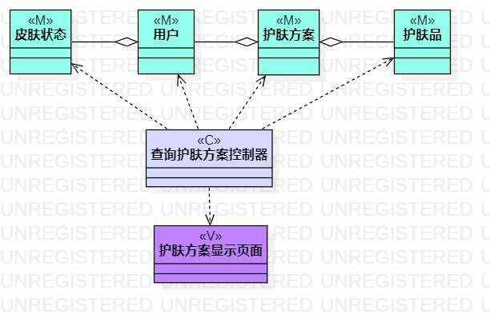
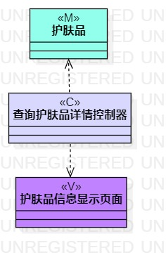

# 实验四五：类建模

## 一、实验目标

1.选题类建模

2.掌握类建模方法

3.掌握类图画法

4.了解MVC或熟悉的设计模式

5.理解类的5种关系

6.掌握类之间关系的画法

## 二、实验内容

1.根据选题进行类建模

2.在用例规约的基本流程和拓展流程中寻找类

3.给系统操作设计业务服务类

## 三、实验步骤

1.确认选题 - 护肤品推荐系统

2.根据选题创建用例图

  * a.确认系统的参与者 - 用户
  
  * b.确认系统的功能 - 录入皮肤状态、查询护肤品详细、查询护肤方案

  * c.建立用户和功能的关系 - 用例图

3.根据用例图中功能攥写3个用例规约

  * 功能a.录入皮肤状态
  
  * 功能b.查询护肤品详细
  
  * 功能c.查询护肤方案

  细化每个功能的业务流程，根据系统需求适当增加扩展流程

4.将用例规约中每个功能的业务流程转换为活动图

  * a.参考演示视频画图
  
  * b.根据实验问题讲解视频修改活动图中可能存在的问题
  
  * c.将用例规约中的基本流程化成活动图

5.将用例规约中存在的类提取出来画为类图

  * a.录入皮肤状态——M（用户账号 皮肤状态） V（皮肤状态选择页面） C（皮肤状态录入控制器）
  
  * b.查询护肤品详情——M（护肤品编号 护肤品名称 护肤品成分 护肤品详细信息） V（护肤品信息显示页面） C（查询护肤品详情控制器）
  
  * c.查询护肤方案——M（护肤品名称 护肤品类型 护肤方案） V（护肤品类型选择页面 护肤方案显示页面） C（查询护肤方案控制器）

## 四、实验结果

1. 用例图

图1：实验二用例图

2. 用例规约

* 表1：录入皮肤状态用例规约  

用例编号  | UC01 | 备注  
-|:-|-  
用例名称  | 录入皮肤状态  |   
前置条件  | 用户登录护肤品推荐系统 |
后置条件  |      |  
基本流程  | 1.用户点击“皮肤状态”按钮|*用例执行成功的步骤*    
~| 2.系统显示选择页面 |
~| 3.用户点击勾选皮肤状态信息，点击“确认录入”按钮 |   
~| 4.系统添加一条皮肤状态信息，提示“录入成功”， |   
~| 5.用户点击“关闭”按钮 |
~| 6.系统返回首页，显示皮肤状态信息 |
扩展流程  | 3.1 系统检查用户选择操作为空，提示“录入信息不能为空”  |*用例执行失败*    

* 表2：查询护肤方案用例规约  

用例编号  | UC02 | 备注  
-|:-|-  
用例名称  | 查询护肤方案  |   
前置条件  | 用户已成功录入皮肤状态 |
后置条件  |      |
基本流程  | 1.用户点击“搜索”按钮  |*用例执行成功的步骤*    
~| 2.系统查询护肤方案 |   
~| 3.系统显示护肤方案页面 |   
~| 4.用户点击“筛选”按钮 |   
~| 5.系统显示护肤品类型选择页面 | 
~| 6.用户选择护肤品类型 |
~| 7.系统检查用户选择操作不为空，查询护肤方案 |
~| 8.系统显示护肤方案 |
扩展流程  | 7.1 系统检查用户选择操作为空，提示“请选择护肤品类型”   |*用例执行失败*  
~| 8.1 系统检查无匹配护肤方案，提示“无匹配护肤方案，请选择其他护肤品类型再次进行搜索”   |

* 表3：查询护肤品详情用例规约  

用例编号  | UC03 | 备注  
-|:-|-  
用例名称  | 查询护肤品详情 |   
前置条件  | 用户登录护肤品推荐系统 | 
后置条件  |      | 
基本流程  | 1.用户在输入框输入护肤品名称，点击“搜索”按钮 |*用例执行成功的步骤*    
~| 2.系统查询护肤品信息 |   
~| 3.系统显示护肤品详细信息 | 
扩展流程  | 2.1 系统检查输入信息为空，提示“请输入护肤品名称”  |*用例执行失败*
~| 2.2 系统检查输入信息不为空，查询不到护肤品信息，提示“无此护肤品，请检查输入名称是否错误”  |

3. 活动图

* 1) 录入皮肤中状态

  
  
  图2：实验三活动图_1
  
* 2) 查询护肤品详情

  
  
  图3：实验三活动图_2
  
* 3) 查询护肤方案

  
  
  图4：实验三活动图_3

4. 类图

* 1) 录入皮肤中状态

  
  
  图5：实验四类图_1
  
* 2) 查询护肤品详情

  
  
  图6：实验四类图_2
  
* 3) 查询护肤方案

  
  
  图7：实验四类图_3

## 五、学习笔记

UML 中类与类, 类与接口, 接口与接口这间的关系有: 泛化(generalization) 关系, 关联(association)关系( 关联, 聚合, 合成), 依赖(dependency)关系，实现(realization)关系

1.聚合（aggregation）关系是一种弱关联。一个聚集对象有多个部件构成，部件是聚集的一部分。例如：车和轮胎的关系，轮胎没了，车依然存在。聚合具有传递性，A聚合B,B聚合C ，A聚合C,并且也具有反聚合性，A聚合C，C不能聚合A

2.组合（compostion）:有两个恩爱的约束条件，一个组成部件至多属于一个装配件。而且一个组成部件一旦被分配给装配件，它就会和装配件有着相同的生命周期。装配件消亡，组成件也将随之消亡。例如：人和胳臂，人消失了，胳臂也不复存在，又例如：程序员没了代码就会死。这种关系要比聚合更强。用实心菱型表示。

3.依赖（dependency）:物体与物体之间产生的依赖关系，就是一个类A使用到了另一个类B，而这种使用关系是具有偶然性的、临时性的、非常弱的，但是B类的变化会影响到A，例如：人依赖空气和水

4.关系所表现的强弱程度依次为：组合>聚合>关联>依赖

