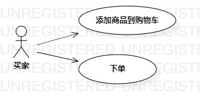

# 实验二

## 1、实验目标
1. 熟悉GitHub实验过程
2. 创建并完善选题

## 2、实验内容
1. 提交选题
2. 说明选题功能需求
3. 画用例图
4. 编写用例规约

## 3、实验步骤
1. 确定选题：#209 B2C购物车系统
2. 完善功能描述:  
(1) 管理员可以管理商品信息，包括增加商品信息，修改商品信息，删除商品信息，查看商品信息。  
(2) 买家可以到平台购买商品，选好的商品会添加到购物车。   
(3) 在购物车中买家确认自己的商品，不买可以撤销商品。    
(4) 确认商品无误后可以下单。
3. 绘画用例图
4. 编写用例规约

## 4、实验结果

    图1:B2C购物车系统的用例图
    
## 表1：添加商品到购物车用例规约  

用例编号  | UC01 | 备注  
-|:-|-  
用例名称  | 添加商品到购物车  |   
前置条件  | 买家进入商品页面   | *可选*   
后置条件  | 买家进入购物车页面   | *可选*   
基本流程  | 1. 系统显示商品页面  |*用例执行成功的步骤*  
~| 2. 系统显示商品的库存信息和价钱  | 
~| 3. 点击“购买”按钮  |
~| 4. 系统查询到商品，创建购物车实例，将商品写入到购物车  |
~| 5. 买家选择好商品后进入购物车页面  |      
扩展流程  | 1. 系统发现买家所购商品库存不足，提示买家“库存不足”信息，系统不会把该商品放进购物车 |*用例执行失败* 

## 表2：下单用例规约  

用例编号  | UC02 | 备注  
-|:-|-  
用例名称  | 下单  |   
前置条件  | 买家进入购物车页面   | *可选*   
后置条件  |    | *可选*   
基本流程  | 1. 系统显示购物车页面  |*用例执行成功的步骤*  
~| 2. 系统显示商品清单和总价钱  |
~| 3. 点击“支付”按钮  |   
~| 4. 系统查询到购物车内商品信息，显示订单确认页面 |
~| 5. 点击“确认”按钮 |
~| 6. 系统创建订单，同时删除购物车实例，弹出“下单成功”警告框 |
扩展流程  | 1. 系统发现购物车里没有商品，提示买家“购物车没有商品”信息，系统不允许买家下单 |*用例执行失败* 
