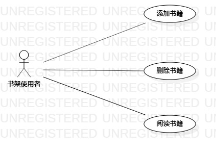

# 实验二：用例建模

## 1.实验目标

- 熟悉如何使用Markdown编写报告
- 细化选题
- 学习StarUML用例建模
- 学会编写用例规约

## 2.实验内容

- 创建用例图
- 编写用例规约

## 3.实验步骤

- 根据选题创建用例图
- 确定参与者
- 确定用例
- 建立参与者与用例之间的关系
- 画出用例图
- 编写用例规约

## 4.实验结果

图1：个人书架的用例图

## 表1：个人书架用例1规约  

用例编号  | UC01 | 备注  
-|:-|-  
用例名称  | 添加书籍  |   
前置条件  |  使用者登录成功   | *可选*   
后置条件  |      | *可选*   
基本流程  | 1.使用者点击添加按钮  |*用例执行成功的步骤*    
~| 2.系统显示添加书籍来源（此处仅有本地文件）  |   
~| 3. 使用者选择添加书籍来源  |   
~| 4. 系统查找本地文件信息，列出可添加文件  |   
~| 5.  使用者选择添加文件，并点击添加按钮 |  
~| 6.  系统通过js读取文件；获取本地路径并保存|
~| 7.  系统显示书架首页|
扩展流程  | 4.1  系统查找本地不存在可添加文件 |*用例执行失败*  
~| 6.1 读取文件失败|
~| 6.2 获取本地路径失败|
~| 6.3 存入数据库失败|

## 表2：个人书架用例2规约  

用例编号  | UC02 | 备注  
-|:-|-  
用例名称  | 删除书籍  |   
前置条件  |  使用者登录成功，书架存在书籍   | *可选*   
后置条件  |      | *可选*   
基本流程  | 1.使用者长按任意书籍  |*用例执行成功的步骤*    
~| 2.系统为所有书籍添加勾选框并显示删除按钮  |   
~| 3. 使用者勾选需要删除的书籍并点击删除按钮  |   
~| 4. 系统删除书籍本地路径  |   
扩展流程  |    |*用例执行失败* 

## 表3：个人书架用例3规约  

用例编号  | UC03 | 备注  
-|:-|-  
用例名称  | 阅读书籍  |   
前置条件  |  使用者登录成功，书架存在书籍   | *可选*   
后置条件  |      | *可选*   
基本流程  | 1.使用者点击书籍  |*用例执行成功的步骤*    
~| 2.系统查询数据库，获取本地路径  |
~| 3.系统根据路径读取文件|
~| 4.系统显示文件内容|
扩展流程  | 2.1获取路径失败   |*用例执行失败*
~| 3.1 读取失败|

