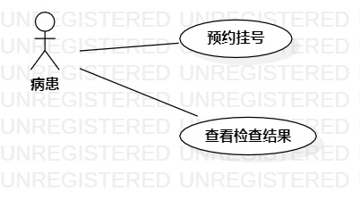

# 实验二：用例建模
## 一、 实验目标
- 1.学习Markdown编写文档的正确语法
- 2.创建issue选题
- 3.学习用例建模

## 二、 实验内容
- 1.用例图画图
- 2.编写用例规约
- 3.完成实验报告

## 三、 实验步骤
- 1.创建issue，选题：核酸检测预约挂号小程序
- 2.根据选题画用例图，参与者——病患，用例——预约挂号、查看检测结果
- 3.编写两个表格的用例规约

## 四、实验结果
- 1.用例图展示  
  
图1 核酸检测预约挂号小程序的用例图

### 表1：预约挂号用例条约
用例编号  |	UC01	|	备注
-|:-|-
用例名称  |	预约挂号	|	
前置条件  |	完善个人信息	|	*可选*
后置条件  |	取得预约号、取样检测时间	|	*可选*
基本流程  |	1.病患点击预约挂号按钮	|	*用例执行成功的步骤*
~|	2.系统提示填写需检测的病患信息	|
~|	3.系统判断病患有确诊病例接触史或符合肺炎疑似病例症状，分配预约号与取样检测时间	|
~|	4.系统保存此次预约记录	|
扩展步骤  |	2.1病患症状没有过接触史且不符合肺炎疑似病例症状，系统提示“不符合预约条件”	|	*用例执行失败的步骤*

### 表2：查看检测结果用例条约
用例编号		|	UC02	|	备注
-|:-|-
用例名称  |	查看检测结果	|	
前置条件		|	取样检测过	|	*可选*
后置条件		|	显示样本检测结果	|	*可选*
基本流程		|	1.病患点击查看检测结果按钮	|	*用例执行成功的步骤*
~|	2.系统检查病患的检测记录，提示检测记录	|
~|	3.点击查看检测记录，系统调取样本库数据，显示阴性或阳性或样本仍在检测中	|
~|	4.系统更新此次查询结果	|
扩展步骤		|	2.1系统发现病患无取样检测记录，提示病患“此前并无预约检测”	|	*用例执行失败的步骤*
~|	2.2系统发现病患取样失败，提示病患“取样失败，需重新预约取样”	|
