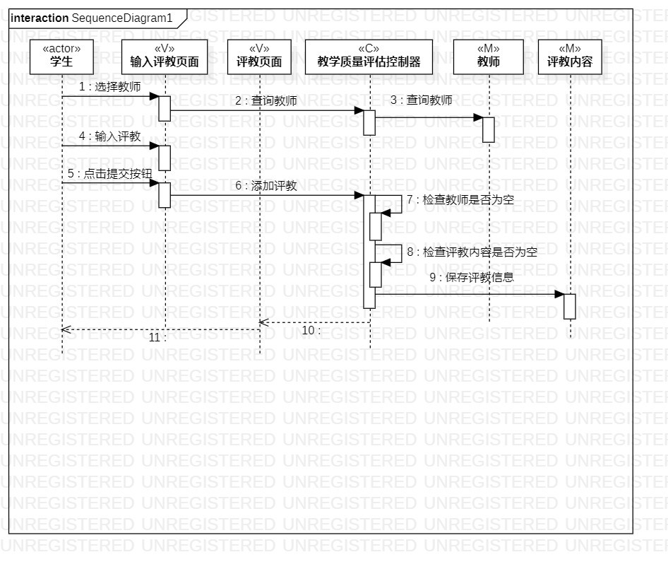

# 实验六：交互建模

 ### 一、实验目标

    1. 理解系统交互

    2. 掌握UML顺序图的画法

    3. 掌握对象交互的定义与建模方法

 ### 二、实验内容

    1. 根据用例模型和类模型，确定功能所涉及的系统对象

    2. 在顺序图上画出参与者（对象）

    3. 在顺序图上画出消息（交互）

 ### 三、实验步骤
 
    1. 在StarUML创建两个顺序图（Sequence Diagram）：  

    （1）查询课表顺序图；  

    （2）查询成绩顺序图；

    （3）教学质量评估顺序图；

    2. 根据活动图和类图画顺序图：  

    （1）根据N+1使用Lifeline画出actor、Model、Controller和View；  

    （2）使用Message表示交互的信息；  

    （3）使用Reply Message表示返回的信息。

 ## 四、实验结果

 

 图1.查询课表顺序图

 

 图2.查询成绩顺序图

 
 图3.教学质量评估顺序图
