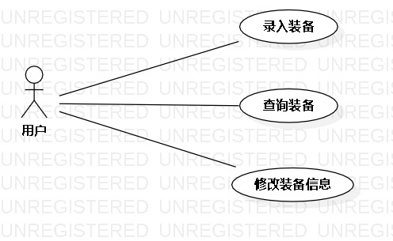

# 实验二：用例建模
## 1.实验目标
观看老师的的视频
学习用例建模
画出用例图

## 2.实验内容
细化功能需求。
画出用例图（Use Case Diagram）。
编写用例规约（表格）

## 3.实验步骤
1.决定选题
2.写出功能需求
3.画出用例图

## 4.实验结果

图1：配装模拟器的用例图
## 表1：录入装备的用例1规约  

用例编号  | UC01 | 备注  
-|:-|-  
用例名称  | 录入装备  |   
前置条件  |      | *可选*   
后置条件  |      | *可选*   
基本流程  | 1.用户点击录入按钮  |*用例执行成功的步骤*    
~| 2. 系统显示录入界面 |   
~| 3. 用户输入装备数据，输入后点击保存按钮 |   
~| 4. 系统保存装备数据  |   
~| 5. 系统提示“录入成功”，返回首页  |   
扩展流程  | 3.1 系统检查装备名称为空，提示“请输入正确的装备名称” |

## 表2:查询装备的用例2规约  

用例编号  | UC02 | 备注  
-|:-|-  
用例名称  |   查询装备   |   
前置条件  |      | *可选*   
后置条件  |      | *可选*   
基本流程  | 1.用户点击查找按钮  |*用例执行成功的步骤*    
~| 2. 系统显示查询界面 |   
~| 3. 用户输入装备名称，点击查询按钮 | 
~| 4. 系统检查装备已录入，系统查询装备信息 |     
~| 5. 系统显示装备信息  |   
扩展流程  | 4.1 系统检查装备名称为空，提示“请输入装备名称” |
~| 4.2 检查装备为录入，提示“装备不存在” |   

## 表3：修改装备信息的用例3规约  

用例编号  | UC03 | 备注  
-|:-|-  
用例名称  |   修改装备信息   |   
前置条件  |   用户查询装备信息   | *可选*   
后置条件  |      | *可选*   
基本流程  | 1.用户点击修改按钮  |*用例执行成功的步骤*    
~| 2. 系统显示修改页面 |   
~| 4. 用户输入装备信息，点击保存按钮 |   
~| 5. 检查装备信息不为空，系统保存装备信息 |  
~| 5. 系统提示“保存成功”,返回首页  |   
扩展流程  | 4.1 系统检查装备信息为空，提示“请输入装备信息” |
