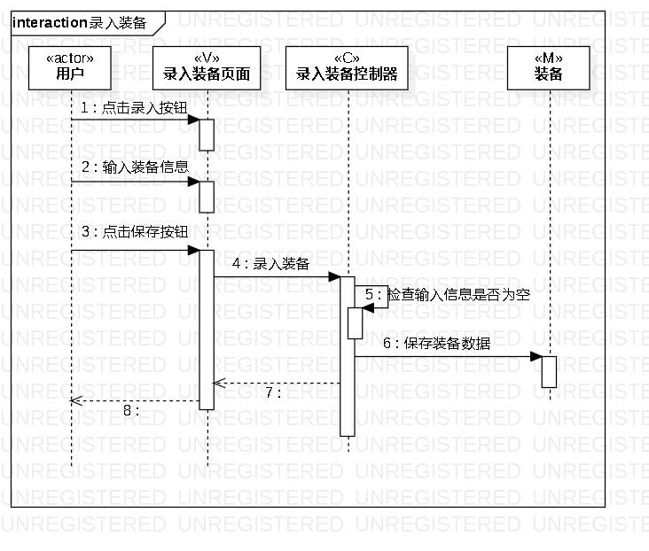
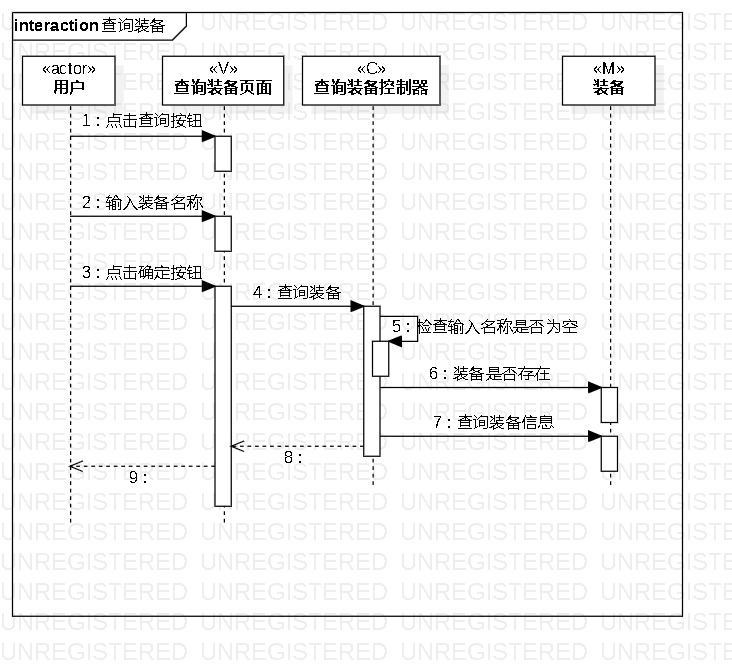
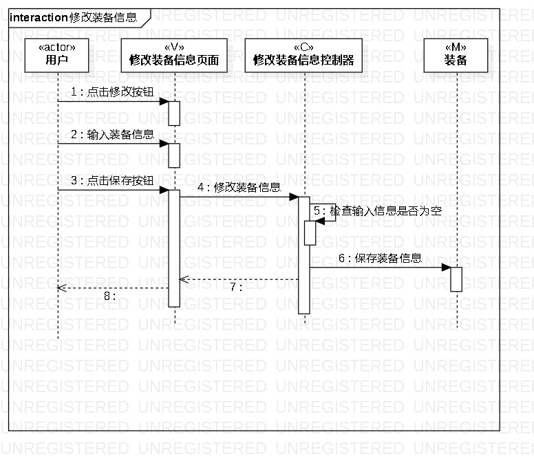

# 实验六：交互建模
## 一、实验目标
1. 理解系统交互；
2. 掌握UML顺序图的画法；
3. 掌握对象交互的定义与建模方法。

## 二、实验步骤
1. 从用例图中找到参与者  
2. 从类图中找到其他N个参与者（N+1）  
3. 从活动图中找到操作步骤  
4. 按时间顺序（从上到下）画出参与者之间的消息

## 三、实验结果
  
图1：录入装备的顺序图  
  
图2：查询装备的顺序图
  
图2：修改装备信息的顺序图

## 四、课堂笔记
1.  顺序图：描述参与者与系统的交互/行为，包括参与者，生命线，事件、信号与消息，存活条。
2.  顺序图的“时间顺序”：仅表示前后顺序，不表示时间跨度。
3.  不同消息类型对应的不同箭头，常见的有同步消息、异步消息和返回消息。

