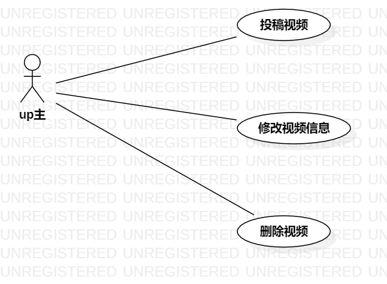

# 实验二 用例建模

##  1、实验目标

1、选题 #693  
2、做出自己选题的UML的use case

##  2、实验内容

1、细化功能需求。      
2、画出用例图（Use Case Diagram）。      
3、编写用例规约（表格）    

##  3、实验步骤

1、选好题  
2、分析有什么人使用该系统和操作  
3、根据分出来的结果画图  
4、编写用例规约

##  4、实验结果

图1 B站视频管理系统用例图

# 用例规约的编写

## 表1：投稿视频用例规约  

用例编号  | UC01 | 备注  
-|:-|-  
用例名称  | 投稿视频  |   
前置条件  | up主进入视频管理页面  | *可选*   
后置条件  |    | *可选*   
基本流程  | 1.up主点击视频投稿按钮  | *用例执行成功的步骤*   
~| 2.系统显示视频投稿页面  |  
~| 3.up主点击上传按钮  |  
~| 4.系统检查电脑中所有格式为MP4的所有视频，弹出”视频选择框“ |  
~| 5.up主选择视频文件，点击确定按钮  |   
~| 6.系统检查到视频文件，开始转码视频，显示“上传中”  |   
~| 7.系统检查到视频上传完成，显示“上传完成”  | 
~| 8.up主输入标题、封面，点击投稿按钮 |   
~| 9.系统检查到所有信息都不为空、标题符合规定和视频上传状态为上传成功，显示“投稿成功”，   |   
扩展流程  | 7.1 系统检查到视频上传出错，显示“上传失败”  |*用例执行失败*    
~| 9.1系统检查到有信息为空，弹出“有信息未填写”   |*  
~| 9.2系统检查到视频标题不符合规定，弹出“标题不符合规定”   |    
~| 9.3系统检查到视频没有上传或上传出错，弹出“视频上传有误”   |   

## 表2：修改视频信息用例规约  

用例编号  | UC02 | 备注  
-|:-|-  
用例名称  | 修改视频信息  |   
前置条件  | up主进入视频管理页面 | *可选*   
后置条件  |  回到视频管理页面   | *可选*   
基本流程  | 1.up主点击视频下的修改按钮  |*用例执行成功的步骤*    
~| 2.系统检查到该视频的相关信息并显示出可修改的信息  |   
~| 3. up主修改视频相关信息并点击提交按钮  |   
~| 4.系统检查所修改信息符合规定，自动保存并显示“修改成功”  |   
扩展流程  | 2.1系统检查不到视频相关信息并弹出“视频不存在无法修改”   |*用例执行失败*    
~| 4.1系统检查所修改信息不符合规定并弹出“所修改信息不符合规定”   |  

## 表3：删除视频用例规约  

用例编号  | UC03 | 备注  
-|:-|-  
用例名称  | 删除视频  |   
前置条件  | up主进入视频管理页面 | *可选*   
后置条件  | 回到视频管理页面    | *可选*   
基本流程  | 1.up主点击视频下的删除按钮  |*用例执行成功的步骤*    
~| 2.系统检查到该视频相关信息并删除，显示“删除成功”  |    
扩展流程  | 2.1系统检查不到视频相关信息，显示“删除失败”   |*用例执行失败*    
