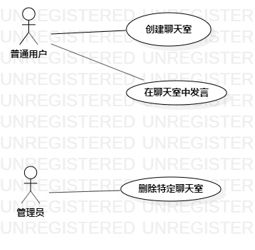

# 实验二：用例建模

## 实验目标
 + 细化功能需求。
 + 画出用例图

## 实验内容
+ 选题为匿名论坛
    功能：
    + 聊天室用户创建聊天室
    + 聊天室用户订阅聊天室
    + 聊天室用户可以在任意聊天室发言
    + 管理员可以删除任意聊天室
+ 参与者
    + 管理员
    + 聊天室用户
+ 确定用例
    + 创建聊天室
    + 订阅聊天室
    + 在聊天室中发言
    + 删除聊天室
+ 编写用例规约

## 实验结果

图一：匿名聊天室用例图

### 表一：创建聊天室用例规约

用例编号 | UC01 | 备注
-|:-|-
用例名称|创建聊天室|
前置条件| 聊天室用户进入匿名聊天软件系统 |
后置条件| 系统产生新的可以被所有聊天室用户所阅览使用的聊天室 | 
基本流程| 1. 播放器用户点击导航栏中创建新的聊天室选项; |
~| 2. 系统加载页面资源，显示发言界面; |
~| 3. 填写任意该聊天室想要发送内容，点击发送按钮; |
~| 4. 系统检测发送内容是否有敏感词，并发送； |
扩展流程| 4.1 系统检测发现该内容相关信息含敏感词; |*用例执行失败*

### 表二：订阅聊天室用例规约

用例编号 | UC02 | 备注
-|:-|-
用例名称|订阅聊天室|
前置条件| 聊天室用户登录进入聊天室系统 |
后置条件| 某特定聊天室进入自己的订阅夹 | 
基本流程| 1. 聊天室用户在聊天室菜单中点击进入想要订阅的聊天室；| 
~| 2. 聊天室用户点击添加订阅按钮; |
~| 3. 系统检测后，将该聊天室加入该聊天室用户的订阅夹中;|
扩展流程| 3.1 系统检测发现聊天室重复订阅; |*用例执行失败*

### 表三：在聊天室中发言用例规约

用例编号 | UC03 | 备注
-|:-|-
用例名称|在已创建的聊天室发言|
前置条件| 聊天室用户登录进入匿名聊天系统 |
后置条件| 聊天室出现发言内容 | 
基本流程| 1. 聊天室用户进入想要发言的聊天室; |
~| 2. 聊天室用户点击发言按钮; |
~| 3. 系统加载页面资源，显示发言界面; |
~| 4. 填写任意内容，完成后点击发送按钮；|
~| 5. 系统检测发送内容是否有敏感词，并发送； |
扩展流程| 5.1 系统检测发现该内容相关信息含敏感词; |*用例执行失败*

### 表四：删除聊天室用例规约

用例编号 | UC04 | 备注
-|:-|-
用例名称|删除已创建的聊天室|
前置条件| 管理员进入后台管理页面 |
后置条件| 聊天室被删除 | 
基本流程| 1. 管理员进入想要删除的聊天室; |
~| 2. 播放器用户点击删除该聊天室按钮; |
~| 3. 该聊天室被隐藏，不再可被普通用户阅览； |