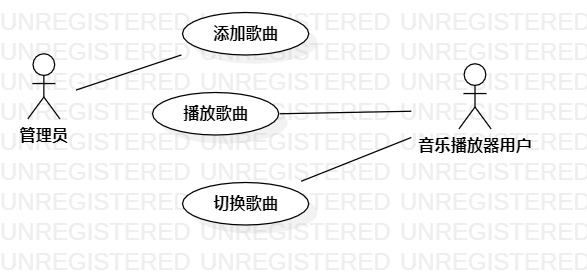

# 实验二：用例建模

## 实验目标
 + 细化功能需求。
 + 画出用例图

## 实验内容
+ 选题为音乐播放器
    功能：
    + 管理员添加歌曲
    + 播放器用户播放歌曲
    + 播放器用户切换歌曲
+ 参与者
    + 管理员
    + 播放器用户
+ 确定用例
    + 添加歌曲
    + 播放歌曲
    + 切换歌曲
+ 编写用例规约

## 实验结果

图一：音乐播放器用例图

### 表一：添加歌曲用例规约

用例编号 | UC01 | 备注
-|:-|-
用例名称|添加歌曲|
前置条件| 管理员进入后台管理页面 |
后置条件| 新的歌曲信息录入系统 | 
基本流程| 1. 点击导航栏中添加歌曲选项; |
~| 2. 系统加载页面资源，显示添加歌曲界面; |
~| 3. 选择歌曲文件以及填写歌曲相关信息，点击保存按钮; |
~| 4. 系统检测信息是否合法，并保存 |
扩展流程| 4.1 系统检测发现歌曲文件或相关信息不合法; |*用例执行失败*

### 表二：播放歌曲用例规约

用例编号 | UC02 | 备注
-|:-|-
用例名称|播放歌曲|
前置条件| 播放器用户登录进入播放器系统 |
后置条件| 播放选择的歌曲 | 
基本流程| 1. 播放器用户在播放器中点击播放按钮| 
~| 2. 播放器用户点击播放列表中的音乐; |
~| 3. 系统查询该音乐相关信息，并使用系统提供的播放组件;|
~| 4. 系统调用相关api，解析传入的.mp3文件，并调用相关播放api播放该资源; |
扩展流程| 4.1 系统检测发现歌曲文件不存在或不合法; |*用例执行失败*

### 表三：切换歌曲用例规约

用例编号 | UC03 | 备注
-|:-|-
用例名称|切换歌曲|
前置条件| 播放器用户登录进入播放器系统 |
后置条件| 切换歌曲并播放该歌曲 | 
基本流程| 1. 播放器用户在播放器中点击切换按钮(可以选择切换上一首或下一首); |
~| 2. 播放器用户点击播放列表中的音乐; |
~| 3. 系统查询切换音乐的相关信息，并在播放器中播放该音乐; |
扩展流程| 3.1 系统检测发现歌曲文件或相关信息不存在或不合法; |*用例执行失败*
