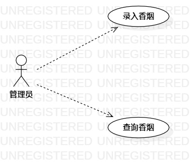

# 实验二：用例建模

##1.实验目标
 - 确定本门课程的个人选题
 - 在个人选题添加个人的功能介绍
 - 画出个人选题系统的用例图
 - 编写用例规约
##2.实验内容
 - 将个人选题提交至issue
 - 在StartUML画出用例图
##3.实验步骤
 - 确定个人选题为：#675 香烟管理系统
 - 功能需求：
	 - 录入新进的香烟
	 - 删除已售完的香烟
	 - 查看已有的香烟
 - 创建本系统的用例图
	 - 在StartUML中新建一个香烟管理系统
	 - 添加一个管理者用例
	 - 根据选题功能创建香烟列表，并对香烟进行录入、删除、查看操作
	 - 导出该用例图至本地仓库中
 - 编写用例规约
 - 提交实验报告

##4.实验结果

  

 	 图一：香烟管理系统的用例图

## 表1：查看香烟列表  用例规约

用例编号  | UC01 | 备注  
-|:-|-  
用例名称  | 查看香烟  |   
前置条件  | 管理员进入列表页面   | *可选*   
后置条件  |   | *可选*   
基本流程  | 1. 香烟管理员点击查看香烟详情；  |     *用例执行成功的步骤*
~| 2. 系统显示香烟详情页面页面；  |   
~| 3. 系统**查询到**香烟信息；  |   
~| 4. 系统显示香烟信息。  | 

## 表2：添加香烟信息  用例规约

用例编号  | UC02 | 备注  
-|:-|-  
用例名称  | 添加香烟  |   
前置条件  | 香烟管理员进入香烟列表     | *可选*   
后置条件  |      | *可选*   
基本流程  | 1. 香烟管理员点击**添加香烟**链接；  |*用例执行成功的步骤*    
~| 2. 系统显示添加香烟信息页面  |   
~| 3. 香烟管理员输入添加的香烟信息和数量，点击添加按钮；  |   
~| 4. 系统**检查到**添加香烟信息，检查香烟信息和数量是否**正确**；  |   
~| 5. 添加香烟信息成功，刷新页面。  |  
扩展流程  | 4.1 系统检查发现香烟信息填写错误，**提示“请输入正确的香烟数量或者香烟名称”**；  |*用例执行失败*      

## 表3：删除香烟信息 用例规约

用例编号  | UC03 | 备注  
-|:-|-  
用例名称  | 删除售完香烟  |   
前置条件  | 香烟管理员进入香烟列表     | *可选*   
后置条件  |      | *可选*   
基本流程  | 1. 香烟管理员点击**删除香烟**链接；  |*用例执行成功的步骤*    
~| 2. 系统显示删除香烟信息页面  |   
~| 3. 系统**查询到**删除香烟信息，询问管理员确认**执行**该操作  |   
~| 4. 删除成功，刷新页面。  |  
扩展流程  | 3.1 系统检查发现用户未确认删除信息或香烟未售完 返回页面|*用例执行失败*      

