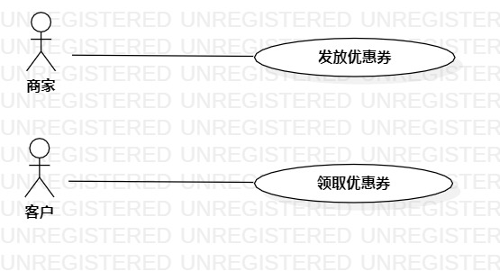

# 实验二：用例建模

## 一、实验目标

1.学习UML及用例的基本概念  
2.确定个人建模选题  
3.学习用例建模  
4.学习用例规约的编写  

## 二、实验内容

1.细化功能需求  
2.画出用例图  
3.编写用例规约  

## 三、实验步骤

1.确定选题为优惠劵发放系统，发布在Issues（#329）  
2.确定参与者（用户）：  
（1）商家  
（2）客户  
3.确定用例（功能需求）：  
（1）发放优惠券  
（2）领取优惠券  
4.根据确定的参与者和用例，绘制用例图  
5.编写用例规约  

## 四、实验结果

优惠劵发放系统的用例图如下所示：  
  
图1：优惠劵发放管理系统的用例图

## 表1：发放优惠券用例规约

用例编号  | UC01 | 备注  
-|:-|-  
用例名称  | 发放优惠券  |   
前置条件  | 登陆用户是商家     | *可选*   
后置条件  | 商家进入优惠券信息填写页面     | *可选*   
基本流程  | 1.商家点击添加发放优惠券；  |*用例执行成功的步骤*    
~| 2.系统显示优惠券信息填写页面；  |   
~| 3.商家输入优惠券信息，点击确认发放；   |   
~| 4.系统验证输入信息的格式正确；   |   
~| 5.系统提示发放成功。   |  
扩展流程  | 4.1系统检查到输入信息的格式不正确   |*用例执行失败*    
~| 2.2   |  

## 表2：领取优惠券用例规约  

用例编号  | UC02 | 备注  
-|:-|-  
用例名称  | 领取优惠券  |   
前置条件  |      | *可选*   
后置条件  |      | *可选*   
基本流程  | 1.客户选中某一优惠券，点击领取  |*用例执行成功的步骤*    
~| 2.『系统』do sth.（响应）  |   
~| 3.   |   
~| 4.   |   
~| 5.   |  
扩展流程  | 2.1   |*用例执行失败*    
~| 2.2   |  
