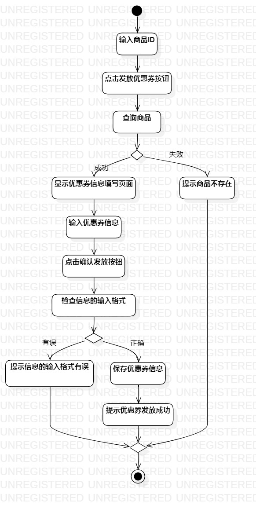

# 实验三：过程建模  

## 一、实验目标  

1.掌握过程建模方法  
2.掌握活动图（Activity Diagram）的画法  

## 二、实验内容  

1.学习过程建模的概念  
2.学习活动图概念及构成  
3.绘制活动图  

## 三、实验步骤  
1.学习过程建模方法、活动图的概念及构成，了解到活动图的作用为：  
- Activity giagrams allow you to specify how your system will accomplish its goals.  

2.根据用例规约使用StarUML绘制用例的活动图  
3.根据绘制活动图过程中所发现的有关于用例规约问题，进一步提炼用例规约

## 四、实验结果  
发放优惠券的活动图如下所示：  
  
图1：发放优惠券的活动图  

领取优惠券的活动图如下所示：  
  
图2：领取优惠券的活动图  

## 五、实验总结  
通过这一次实验，我才体会到用例规约对后面的实验有多么的重要。比如在这次实验中，如果用例规约写得简练、准确，那么照着这样的用例规约来绘制活动图将会很简单。我在实验二写的领取优惠券用例规约并不够精炼，导致在画该用例的活动图时，会卡在一个Action上，需要不断地修修改改。当然，通过这样的一个过程，用例规约也被我进一步地提炼。  
