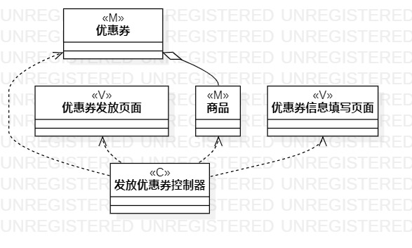
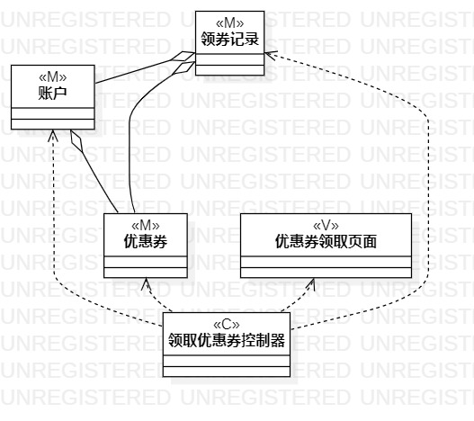

# 实验四五：类建模、高级类建模  

## 一、实验目标  

1.掌握类建模方法  
2.了解MVC或个人所熟悉的设计模式
3.掌握类图（Class Diagram）的画法  
4.理解类的5种关系  
5.掌握类之间关系的画法  

## 二、实验内容  

1.学习类的概念以及类建模方法  
2.学习类的5种关系  
3.学习MVC设计模式  
3.绘制类图  

## 三、学习笔记  

1.What is a class？  
- It has an identity.  
- A class is a type of something.  
- Attributes and operations are the mainstays of a class's description.（属性与操作）  
2.At its simplest,a class in UML is drawn as a rectangle split into up to three sections.（用尖角矩形表示）  
- The top section contains the name of the class.（名称）  
- The middle section contains the attributes or information that the class contains.（属性）  
- The final section contains the operations that represent the behavior that the class exhibits.（操作）  
3.UML's four different visibility classifications.  
- Public、Protected、Package、Private.   
4.Class relationships.(It's better to build a weak class relationship——低耦合)  
- Dependency:When objects of one class work briefly with objects of another class.(Weaker class relationship)  
- Association.（联合）  
- Aggregation.（聚合）  
- Composition.（组合）
- Inheritance:When one class is a type of another class.(stronger class relationship)  
5.MVC Design Pattern  
- Model.（模型、实体、数据）  
- View.（视图、界面）  
- Control.（控制器、系统）  

## 四、实验步骤  
1.在类图中增加Control类（发放优惠券控制器和领取优惠券控制器）  
2.在类图中增加View类（优惠券的信息填写页面和已发放优惠券的信息页面）  
3.根据用例规约提取出各类信息、数据  
4.将提取出的信息、数据抽象成类，作为MVC设计模式中的Model  
5.在类图中增加Model类  
6.设计各Model类之间的关系  

## 五、实验结果   
  
图1：发放优惠券的类图  
  
  
图2：领取优惠券的类图  

## 六、实验总结  
通过这一次实验，我学习了类的基本概念、类建模方法、类之间的关系以及MVC设计模式。在画类图的过程中，我认为最重要的是要把用例规约中的各类信息、数据找出来，并抽象成一个类，最后还要考虑这些类之间是否存在着某种关系。从MVC设计模式角度来看，主要就是要找出Model以及Model之间的关系。如果能把这些理清楚，那么类图就基本没什么问题了。  
